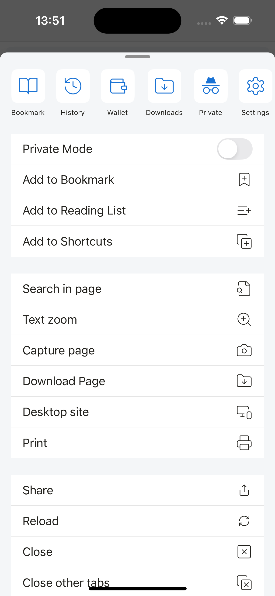
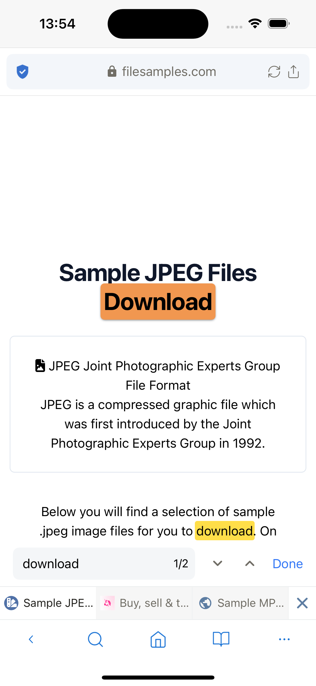

# Browser Tool Menu

Provides a range of tools to enhance users' web browsing experience.

- Add to Bookmark
- Add to Reading List
- Add to Shortcuts
- Search in page: search for words on a web page

- Text zoom: resize text by percentage.

- Capture page: take a screenshot of the current web page, the image will be stored in the /Downloads folder.
- Download Page: downloads the html of the current web page. For direct PDF file links, will download the PDF file.
- Desktop site / Mobile site: change desktop/mobile view of website.
- Print: connect to the printer and print the current web page.
- Share
- Reload
- Close: close current tab
- Close other tabs: close all open tabs excluding the current tab.
