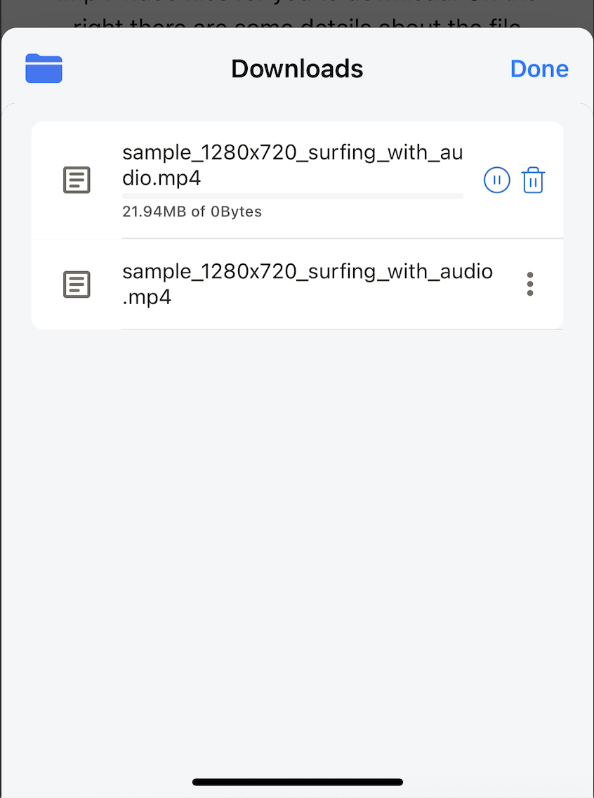

# Download File

The browser supports downloading most audio, video, image, document, and other file formats.

For iOS, all downloaded files will be stored in *On My iPhone/Lunascape/Downloads*. They are also displayed in the Files app. Users can edit/delete downloaded files through the Lunascape and Files apps. When the Lunascape app is uninstalled, all files downloaded by Lunascape **will be deleted**.

For Android, downloaded files will be stored in *Downloads/Lunascape*. They will also be visible in other File Manager apps. Users can edit/delete files in both Lunascape and other File Manager apps. When the Lunascape app is uninstalled, files downloaded by Lunascape **will not be deleted**.

Lunascape supports actions: pause/resume/cancel downloading file, edit/delete downloaded file.

