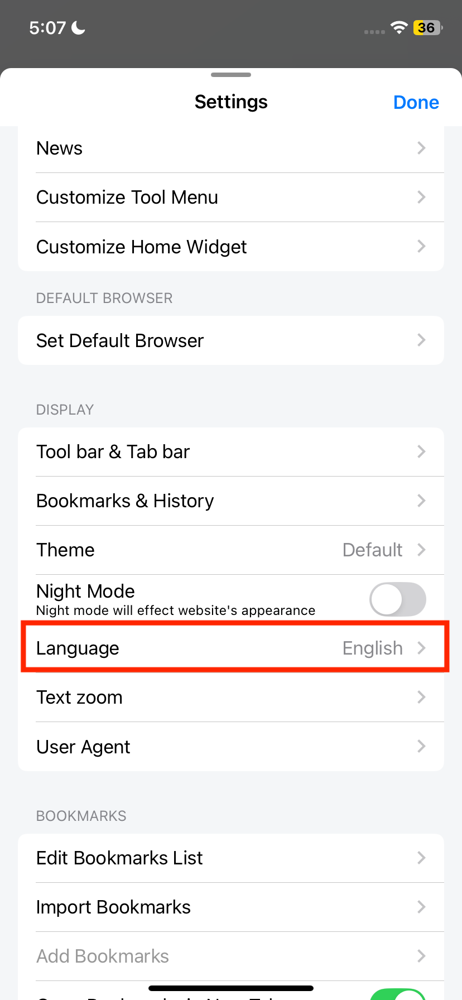

# Default RSS Sources
<!-- 
- **Specific Language-Region Combination**: First, it looks for an exact match using the format `{language}-{region}` (e.g., en-us, es-mx, en-ca)
     -->
    Change the language setting (Lunascape mobile setting)
    
    
    
    iOS: Change the region setting (OS Setting → General → Language & Region → Region)
    
    