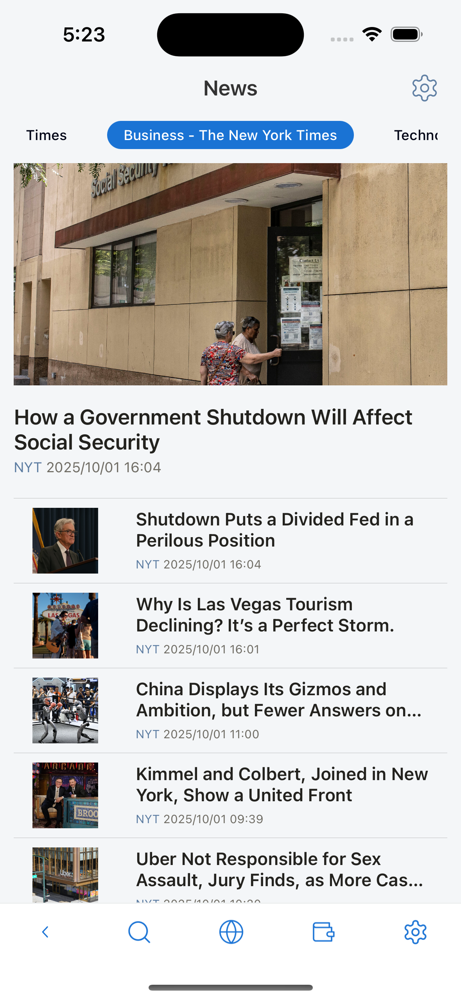

# News Overview

## Table of Contents

- [News Setting](news-setting) - Add, remove, edit, and reset RSS feeds
- [News Sources Selection](news-sources-selection) - Review and select news sources after updates
- [Default RSS Sources](default-rss-sources) - Configure default RSS sources based on language and region

## What This Section Covers

This section explains how to use the News features in Lunascape. You'll learn how to:

- Set up and configure news sources and RSS feeds
- Select which news sources to follow
- Manage default RSS sources for automatic news updates
- Access and read news articles from various sources

The News feature helps you stay informed by aggregating content from multiple RSS feeds and news sources in one convenient location.

Displays a list of articles and news from RSS sources installed in Settings. For each language there will be a default RSS list.

You can add/remove RSS. It is recommended to use RSS version 2.0, if you use lower RSS versions the feature may not work properly or the news list will not be retrieved.

