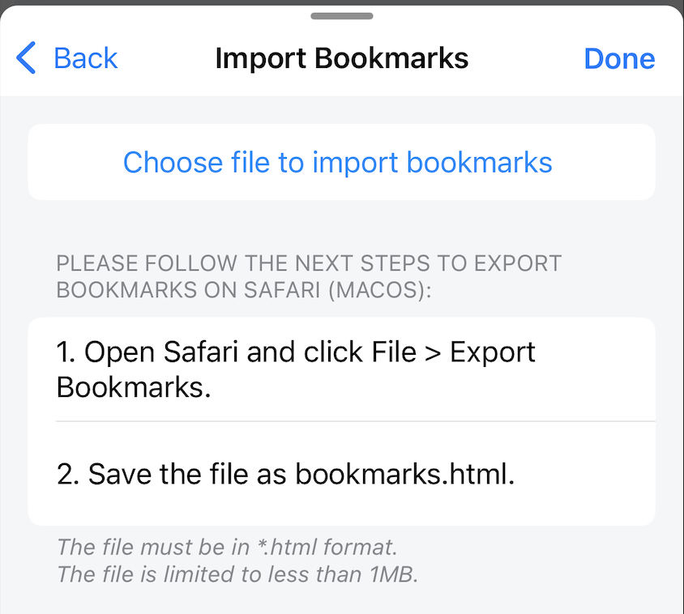
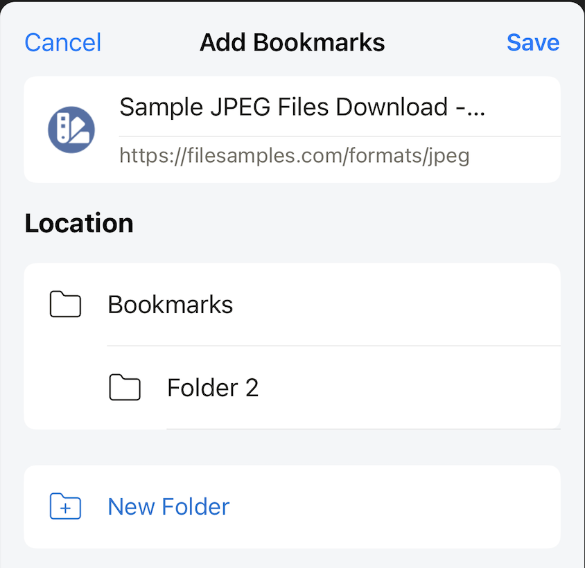

# Bookmarks Settings

Settings for Bookmarks

## Edit Bookmarks List

Open Bookmarks modal, users can add/edit/delete bookmark list here.

## Import Bookmarks

Users can import Bookmarks from browsers that support the Export Bookmarks feature such as Safari. Support users to move Bookmarks from other browsers quickly.

## Add Bookmarks

Open Add Bookmarks modal, user can add open website to Bookmarks list.

## Open Bookmarks in New Tab

When enabled, click on bookmarks, the website will be opened in a new tab.

When disabled, click on bookmarks, the website will be loaded in the current tab.

*Default: enable*
