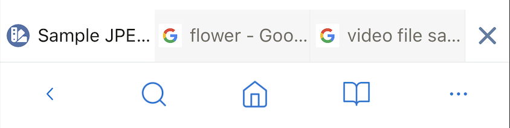
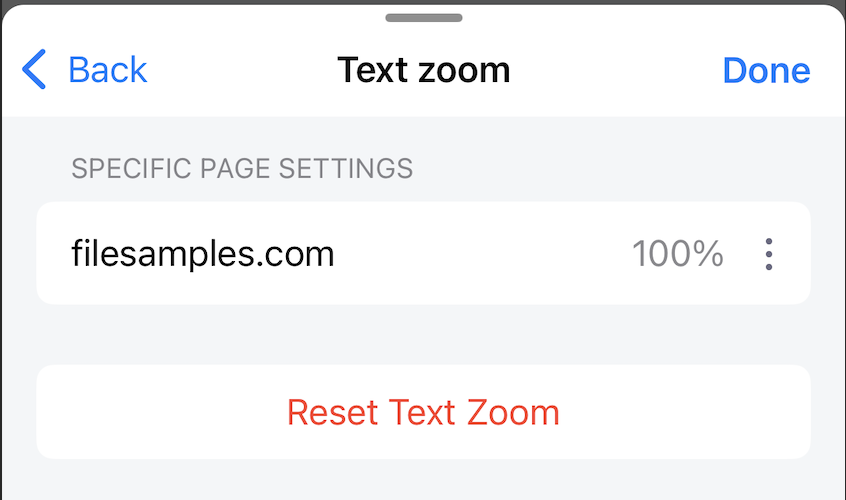
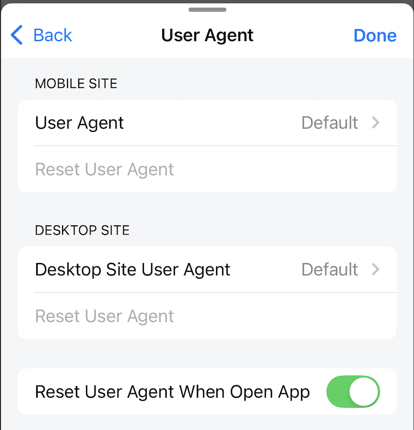

# Display Settings

Settings related to the display.

## Tool bar & Tab bar

**Show Tab Bar**

When enabled, the tab bar is displayed.

When disabled, the tab bar is not displayed, instead it displays the number of tabs currently open.

*Default: enable*

**Auto-Hide Tool Bar**

When enabled, when scrolling down in the web page the tabbar/toolbar will be hidden to increase the display area of the web page, when scrolling up the tabbar/toolbar will be displayed again.

When disabled, the toolbar/tabbar is always displayed when scrolling up/down in the web page.

*Default: enable*

**Auto-Hide Tab Bar for Single Tab**

When enabled and only one tab is open, the tabbar will be hidden.

When disabled, the tabbar will be hidden/shown according to the Show Tab Bar setting.

*Default: disable*

**Enable Tab Menu When Long Pressed**

When enabled, tap and hold on the tab bar The tab menu will be displayed.

*Default: enable*

## Bookmarks & History

**Modal style**

Provides 2 types of layout styles when opening Bookmarks and History modal: Half and Full

*Default: Half*

## Theme

Install theme for Lunascape application, excluding web page viewed on browser.

Provides 2 types of themes: Default (Light) and Black.

Depending on the ***Use Dark Mode*** setting, the setting will work differently.
***Use Dark Mode*** means that the phone system uses Dark mode.

***Use Dark Mode*** is disabled by default. Now, whether the phone system is set to Dark mode or Light mode, the theme inside the application will follow the settings of the first Default/Black theme block.

If ***Use Dark Mode*** is enabled and:

- The phone system setting is Light mode, the app theme will follow the settings of the first Default/Black theme block.
- The phone system setting is Dark mode, the app theme will follow the settings of the last Default/Black theme block.

*Default theme: Default*

## Night Mode

***Night mode*** is a theme setting for only websites browsed in the browser.
***Theme*** is a theme setting for the Lunascape application that does not include websites browsed in the browser.
These are two settings for different parts and work separately.

When disabled, Dark mode is not applied to the website.

When enabled, Dark mode applies to the website.

*Default: disable*

## Language

Set the language for the application. Currently supports 20 different languages.

*Default: according to the system language at the time of application installation.*

## Text zoom

Stores a list of domains with text zoom set.
Each domain can have a different scale set.
Users can delete the installed domain here, the text zoom scale of that domain will return to normal.

## User Agent

Users can set different user agents for Mobile site and Desktop size views.

Users can also reset the user agent to default.

*Default*

*Mobile site: Mozilla/5.0 (iPhone; CPU iPhone OS 18_0 like Mac OS X) AppleWebKit/605.1.15 (KHTML, like Gecko) Version/18.0 Mobile/15E148 Safari/604.1*

*Desktop site: Mozilla/5.0 (Macintosh; Intel Mac OS X 10_15_7) AppleWebKit/605.1.15 (KHTML, like Gecko) Version/17.5 Safari/605.1.15*

**Reset User Agent When Open App**

When enabled, all user agents will be set to default every time the application is restarted.

When disabled, all installed user agents will be kept every time the application is restarted.

*Default: enable*
