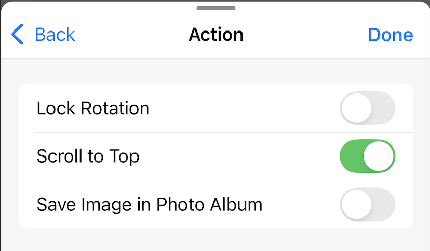
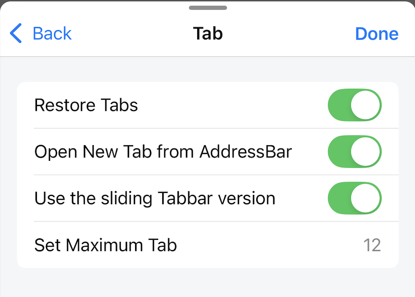
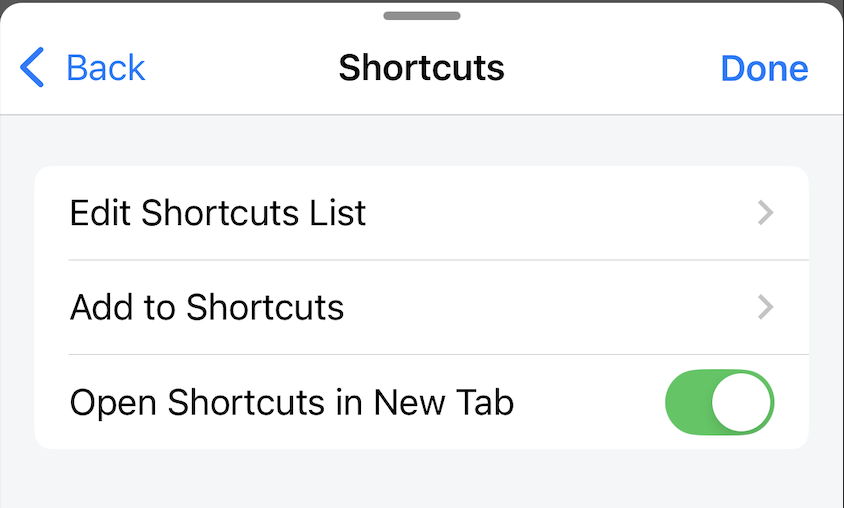
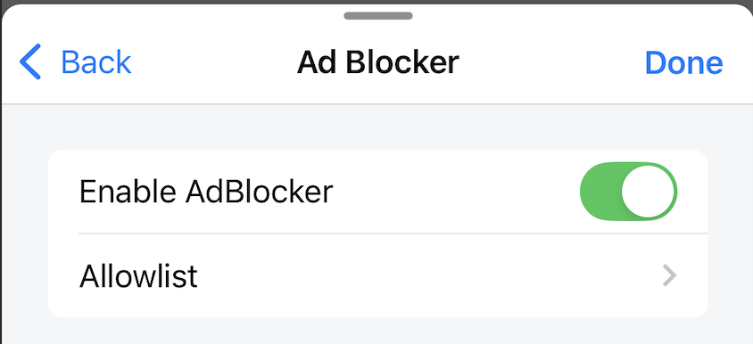
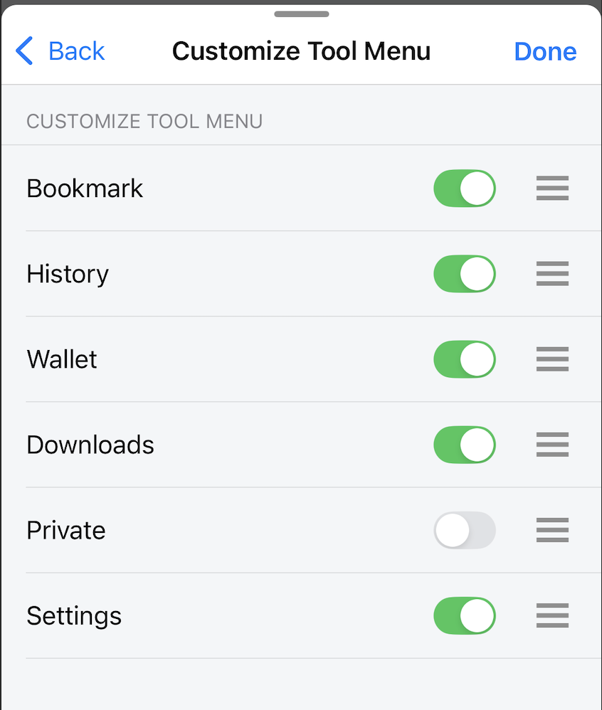
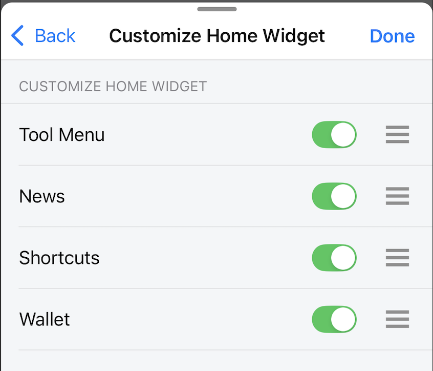

# General Settings

General customizations for Home, Tab, Browser, Widget.

## Action

**Lock Rotation**

When enabled, the app is always in portrait mode.

When disabled, the app will change portrait/landscape mode when rotating the phone. But if the phone's system setting is Lock rotation, the app is always in portrait mode.

*Default: disable*

**Scroll to Top (iOS only)**

When enabled, tap the status bar area on the right corner, the website will automatically scroll to the top of the page.

*Default: enable*

**Save Image in Photo Album/Gallery**

When disabled, "Save image" will save the image to the /Downloads folder.
When enabled, "Save image" will save the image to the Photo Album/Gallery.

*Default: disable*

## Tab

**Restore Tabs**

When enabled, restarting the application will reopen previously opened tabs.

When disabled, restarting the application will not reopen previously opened tabs.

*Default: enable*

**Open New Tab from AddressBar**

When enabled, tap the Address bar of the current tab then type the search term or link, then press enter, the result/website will be opened in a new tab. 

When disabled, tap the Address bar of the current tab then type the search term or link, then press enter, the result/website will be loaded in the current tab.

*Default: enable*

**Use the sliding Tabbar version**

When enabled, the sliding tabbar is used, performing a swipe on the tabbar to select the displayed tab.

When disabled, the normal tabbar is used, the tabbar will be in list form, performing a horizontal scroll to select the tab.

*Default: enable*

**Set Maximum Tab**

Set the maximum number of tabs that can be opened at the same time.
The minimum value that can be set is 6, the maximum value that can be set is 30.
If the user sets a value greater than 12, a warning will be displayed. We do not recommend setting the value too large, it will affect the application performance and browsing experience.

*Default: 12*

## Shortcuts

**Edit Shortcuts List**

Open Shortcuts modal, users can perform the following operations:

- Create new shortcut
- Reset the shortcut list to default
- Change the location of shortcuts
- Delete shortcut

**Add to Shortcuts**

Open the Add to Shortcuts screen, users can create new shortcuts here.

**Open Shortcuts in New Tab**

When enabled, tap the shortcut, the website will be loaded in a new tab.
When disabled, tap the shortcut, the website will be loaded in the current tab.

*Default: enable*

## Ad Blocker

**Enable AdBlocker**

When enabled, ad blocking will work, but will not work on websites on the Allowlist.

When disabled, ad blocking will not work.

*Default: disable*

**Allowlist**

Set a list of websites that the ad feature will not work on.

Users can manually add/remove from the list.

## News

Set up the news list. Users can add/edit/delete RSS feeds.
Each RSS feed corresponds to a news page on the News screen. Users can change the location of the news pages as they wish.
Each language will have a different default RSS feed list.
Reset Feeds will reset the RSS feed list to the default according to the current language.

## Customize Tool Menu

Set the position, hide/show of the Tool menu list displayed on the Home screen

## Customize Home Widget

Set the position, hide/show of the Widgets displayed on the Home screen

