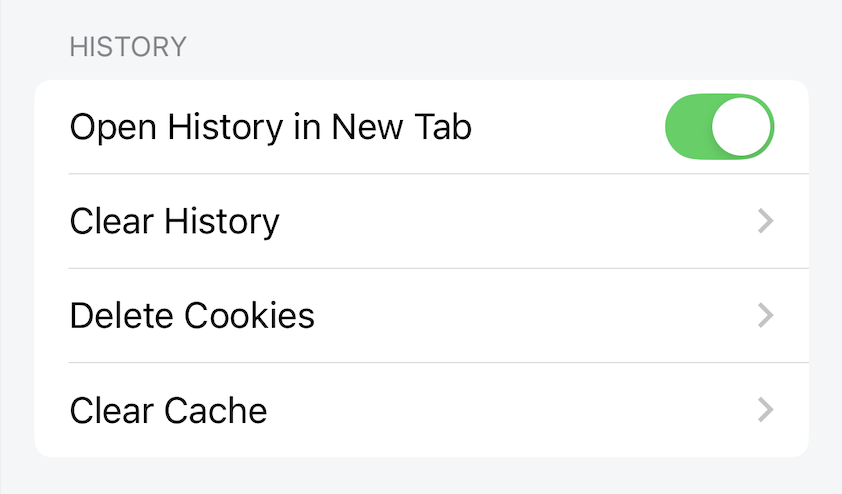

# History Settings

Settings for History

## Open History in New Tab

When enabled, click on history, the website will be loaded on a new tab.

When disabled, click on history, the website will be loaded on the current tab.

*Default: enable*

## Clear History

When the user performs the Clear History action, a confirmation dialog will be displayed, if agreed all browsing history will be deleted.

## Delete Cookies

When the user performs the Delete Cookies action, a confirmation dialog will be displayed, if agreed all web cookies will be deleted.

Web cookies are components that support users when browsing the web.
For example, when a user logs in to website A, a cookie will be saved by the browser. On subsequent visits to website A, the user will not have to log in, and will use the web with a logged in status. If this cookie is deleted from the browser, the user will have to log in to website A again.

## Clear Cache

When the user performs the Clear Cache action, a confirmation dialog will be displayed, if agreed, the entire web cache will be deleted.

Web cache is a component that helps users browse the web faster. When browsing the web for the first time, web components will be newly loaded and cached. In the next web browsing, because the cached components do not need to be newly loaded, the web will load faster, saving more bandwidth.
Cached components such as images, html, css.
