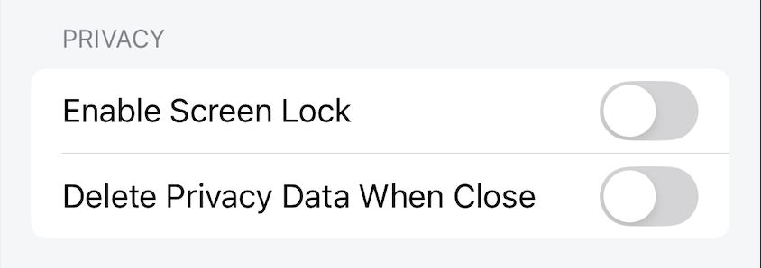

# Privacy Settings

Settings for Privacy

## Enable Screen Lock (iOS only)

When enabled, the application is protected by Screen Lock, the entire content of the application will be covered by Screen Lock. To bypass, the user needs to use the device's face id/touch id/passcode.

Default: disable

## Delete Privacy Data When Close

When enabled, every time the application is closed, all user browsing data will be deleted.

Affected data: browsing history, search history, web cookies, web cache.

Default: disable
