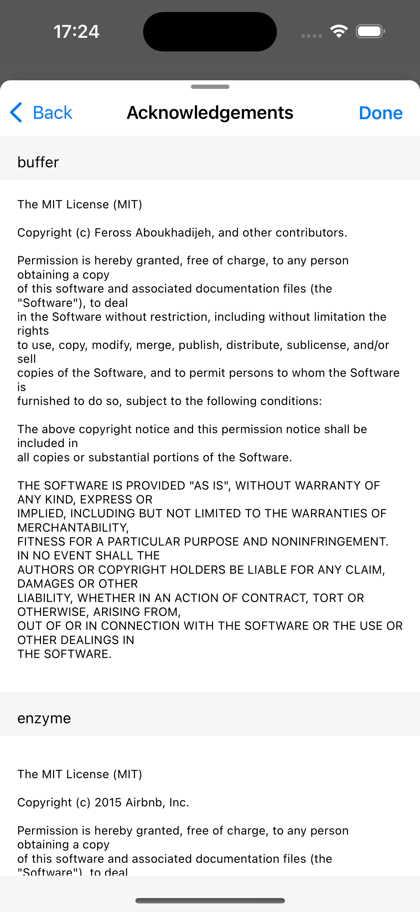

# Support Settings

## Online Help

Open the Lunascape app [FAQ](https://help.gu.net/lunascape-for-mobile-faq) page in your browser. Users can look up common issues here.

## About

Introduce the current version of the application.

## Release Note

Introduce all changes of current version compared to previous version.

## Acknowledgements

Lunascape is built on many open source libraries. This is a screen that shows the open source licenses of all the libraries Lunascape uses.

