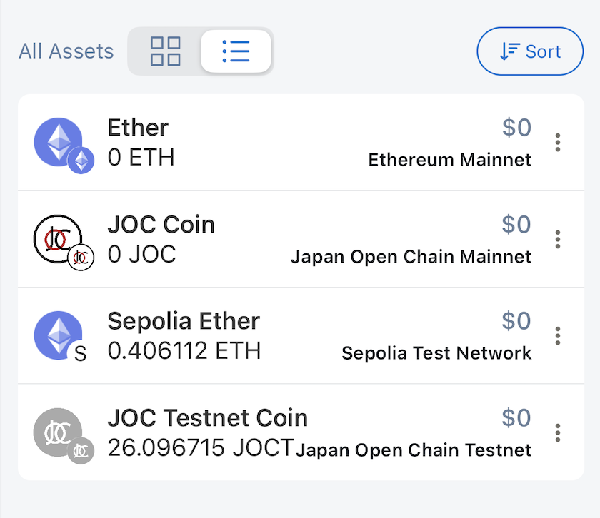
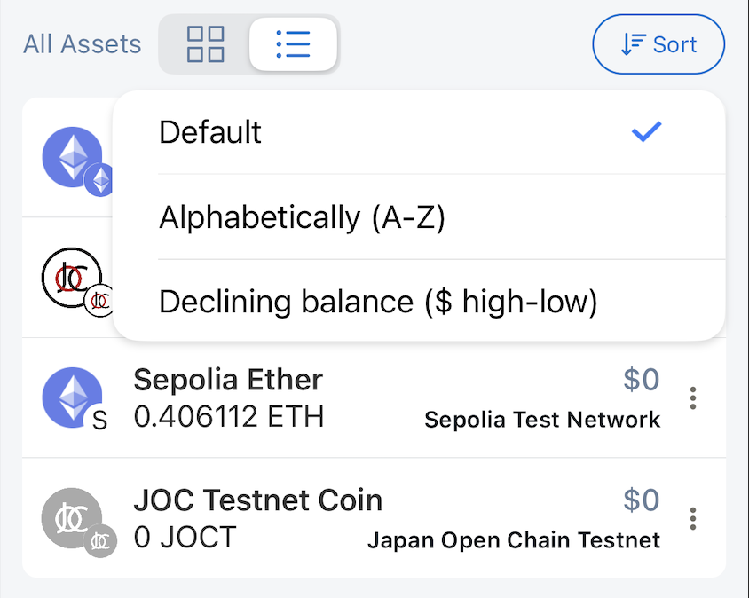
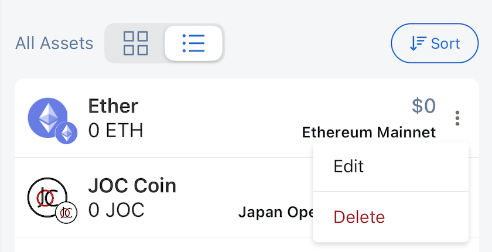

# Asset List

This is the screen that shows the balance information and all tokens of the currently selected wallet, and a few other features.

## Total Balance

Same as Dashboard/Total Balance

## All Assets

Lunascape supports two types of lists: card and list.

Card

List

Supported sorting types:

- Default: last viewed tokens will be at the top of the list
- Alphabetically (A-Z)
- Declining balance ($ high-low)

Users can also perform Edit/Delete token operations

## Token Detail

Display token information:

- Token name
- Token symbol
- Token balance
- Corresponding fiat value
- Token network
- Transaction history

Users can also perform quick actions on the displayed token:

- Send
- Receive
- Scan to Send

## Edit Token

The application only allows users to edit 2 values:

- Decimals for display
- Card Color

