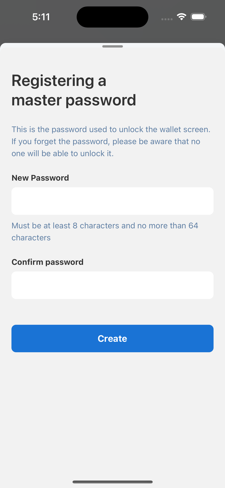
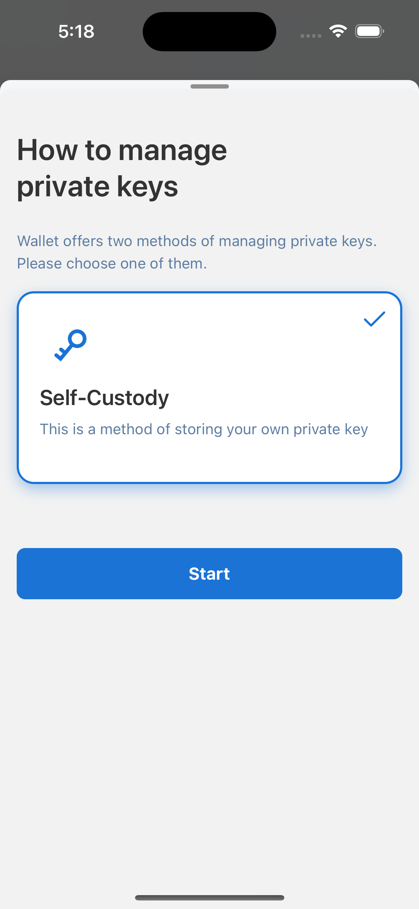
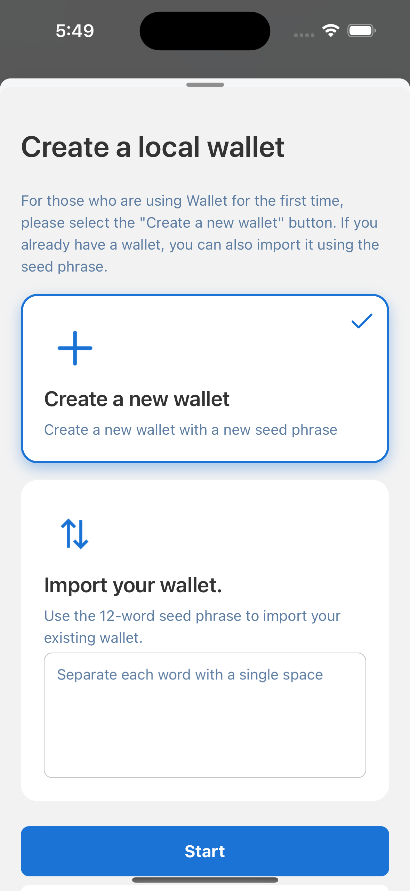

# Create Wallet

Users can create a new wallet or import an existing wallet using seed phrase.

Users can create arbitrary passwords limited from 8 to 64 characters.

Currently, Lunascape only provides one private keys management method, Self-Custody. All seedphrases and private keys of the wallet will be stored on the phone's Keychains and self-stored. Regarding Keychains, this is a secure storage area on the phone, encrypted to ensure data security.

Create new wallet

Or import seed phrase of existing wallet

The default network selected after successfully creating a wallet is Ethereum Mainnet.
