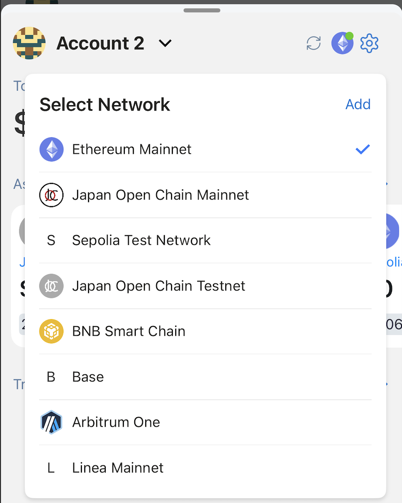
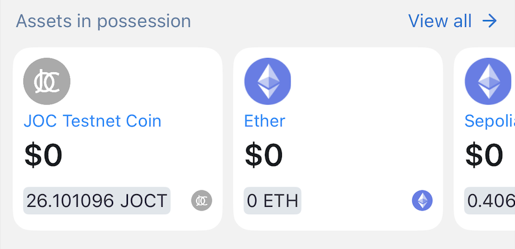
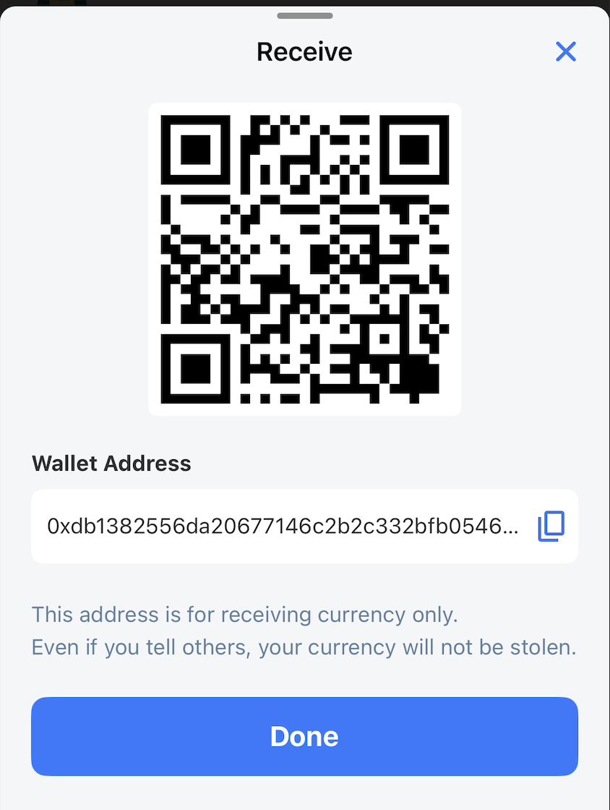

# Wallet Dashboard

The selected account's overview information is displayed such as Account Name, Network, Total Balance, Assets, Transaction History and Footer.

## Account Name

Account name is displayed at the top.

Users can switch accounts, add new accounts or lock wallet by clicking here.

## Network

The icon of the selected network is displayed on the right side of the top.
User can switch networks or add new networks here.

## Total Balance

Displays the total balance of the current account in the selected fiat currency. There are 9 fiat currencies supported.
The user can hide/show this value for privacy.

## Assets

Shows the list of tokens in the current account. By default the last used token will be shown at the top of the list.

## Transaction History

The current account's latest transactions will be displayed. Only outgoing transactions are shown in this list. Incoming transactions are not supported.

## Send Transaction

Users can access the Send screen by clicking the Send button in the footer.

On the Send screen, users select the wallet address to receive and the token to send.

The application supports the Address Book feature - a place to store the wallet address contacts that users know, to help make transactions more convenient and accurate.

Users can also scan the wallet address with QR code conveniently.

Users can adjust the transaction fee. The application automatically supports 3 settings: Slow/Average/Fast, but users can still specify the desired value.

## Receive Transaction

To display the current receiving wallet address, click the Receive button in the footer.

The app supports both copying the wallet address and QR code of the wallet address.

## Quick scan QR code

You can click on the QR scan icon in the footer to perform actions like Connect wallet using WalletConnect, Transfer tokens to scanned wallet address.

