# Wallet Operations with DApp

## Connect Wallet

In DApp, click on the Connect button to display the connection wallet options. Select Lunascape, a connection confirmation popup will be displayed, the user confirms the connection.

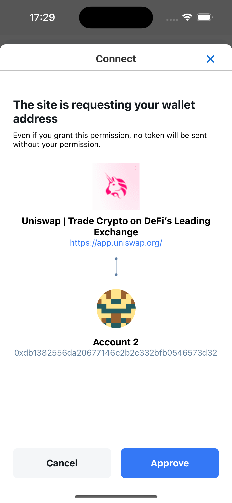

On some DApps like Pancakeswap, the Lunascape wallet may not be shown in the list of connected wallets. Please enable ethereum.isMetaMask, and connect under the name of the Metamask wallet.

## Add Token

There are 2 methods to add new tokens to the wallet.

### Method 1: add token manually

On the Asset List screen, click the Add button. The Add Assets screen will be displayed.

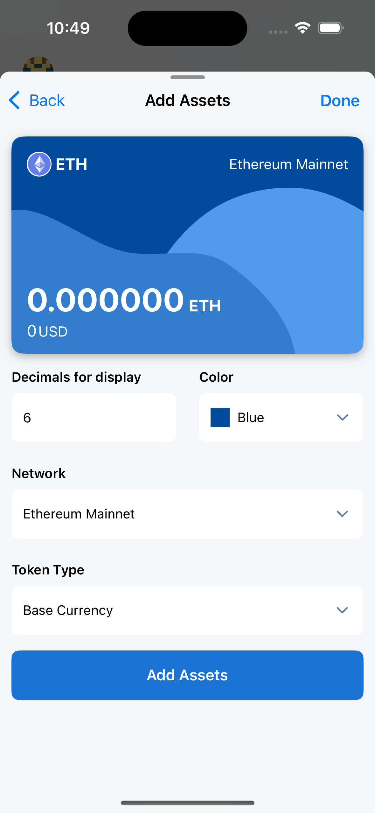

For Token Type is **Base Currency**, users just need to select **Network** to add the corresponding native token.

For Token Type is **ERC-20**, users fill in the **Contract Address** in the Address field. The QR code scanning feature is also supported.
After filling in the Contract Address, the token information will be automatically displayed, including: Token Name, Symbol, Decimals.

**Note**: an ERC-20 Token can have **one or more contract addresses**, each address will correspond to a network that this token is supported.
For example: USC is supported on many networks such as: Ethereum, BNB Smart Chain, Solana, Polygon, ... And the corresponding contract addresses are:

- Contract address on Ethereum: 0xa0b86991c6218b36c1d19d4a2e9eb0ce3606eb48
- Contract address on BNB Smart Chain: 0x8ac76a51cc950d9822d68b83fe1ad97b32cd580d
- Contract address on Solana: EPjFWdd5AufqSSqeM2qN1xzybapC8G4wEGGkZwyTDt1v

So if the user fills in the contract address incorrectly with the selected network, the correct token information will not be obtained.

Finally, the user clicks the **Add Assets** button to complete the process of adding a new token.

### Method 2: add tokens from DApp

Users can add new tokens from the DApp they are using.

For example, users can search and add a lot of tokens from CoinMarketCap - this is a famous, legitimate and safe website. Here, users can search for the desired token, then go to the **Contracts** field.

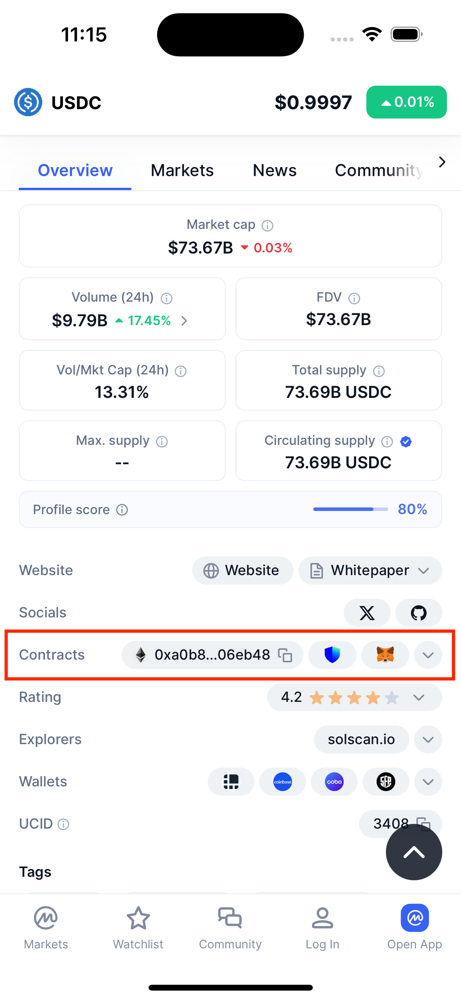

Next, navigate to the contract address that corresponds to the network selected in your wallet. If the Ethereum network is selected in your wallet, navigate to the Ethereum network contract address. Then, click on the MetaMask icon.

Next, a popup asking for permission to connect to CoinMarketCap will be displayed. If you have connected before, the popup asking for permission to connect will not be displayed.

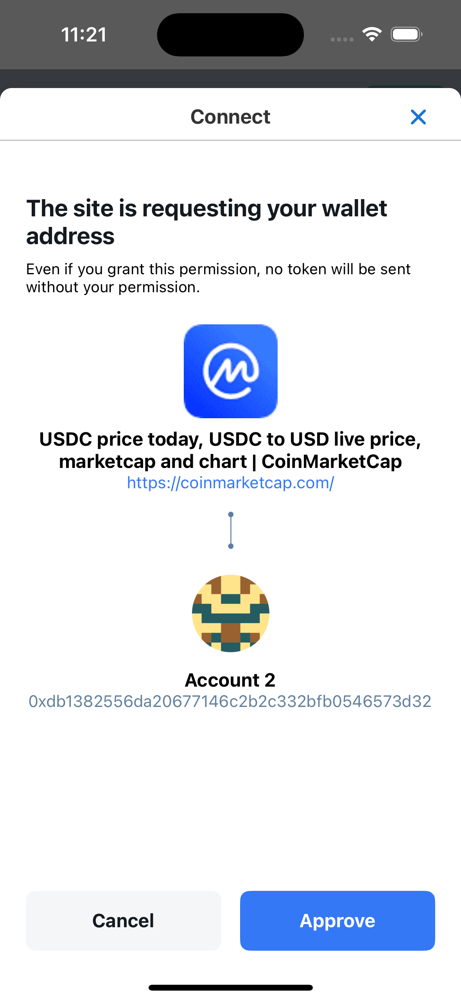

After the user confirms the connection, a token add popup will be displayed.

Finally, the user clicks the **Add tokens** button to complete the token adding process.

## Add Network

There are 2 ways to add network

### Method 1: add network manually

Check the instructions at Setting/Network/Add Network

### Method 2: add network from DApp

In DApp, when a user performs a network conversion or adds a network and that network does not exist in the wallet, a popup confirming the addition of the network will be displayed, the user will confirm the addition of the network.

**Note**: when a new network is added, the native token (base currency) of that network will also be automatically added to the wallet.

## Switch Network

When a user switches networks on the DApp, a network switch confirmation popup will be displayed.

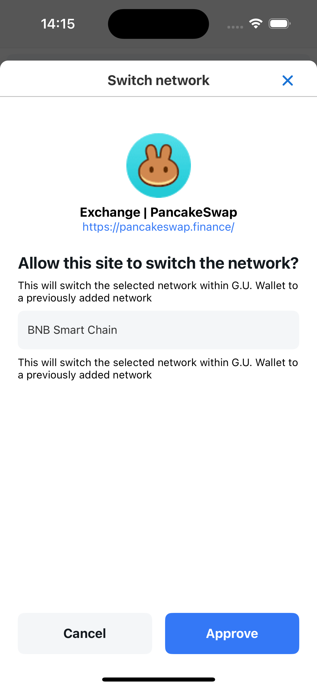

Conversely, when a user switches networks on the wallet, the DApp will automatically switch to the corresponding network (no confirmation popup is displayed in this case)

In the following case: network A has been added to the wallet, but the native token (base currency) of network A has been removed from the wallet. When the user performs a network switching operation on the DApp, the popup confirming the addition of the network's native token will be displayed first, after the user confirms, the popup confirming the network switching will be displayed next.

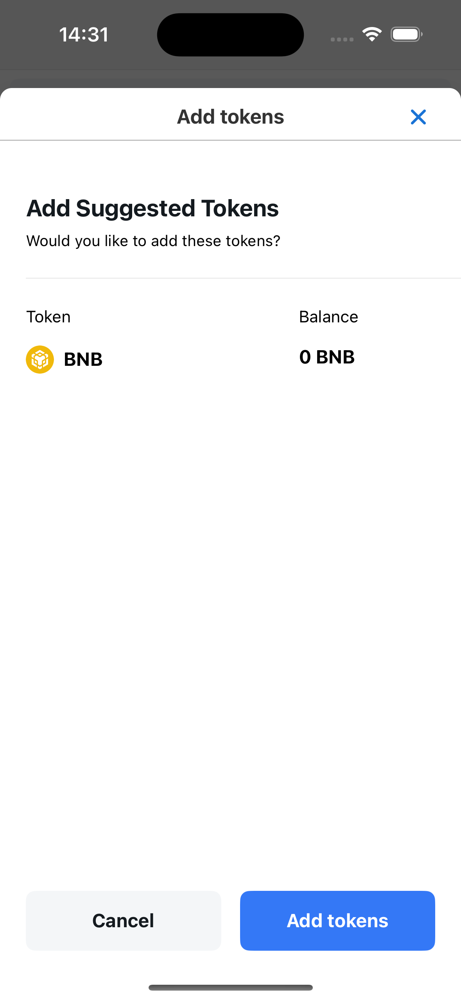

## Sign the transaction

Many DApps support login via wallet, which means users can create active accounts on the DApp using their wallet information.

After connecting the DApp to the wallet, the user will sign a transaction to confirm account creation or use of the DApp.

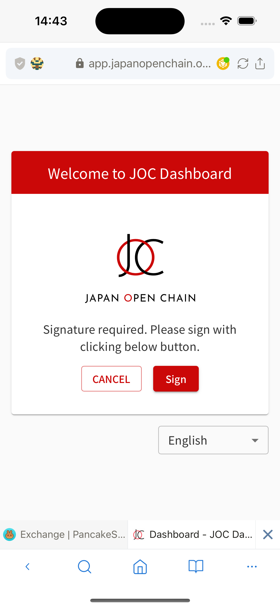

When the user clicks the Sign button on the DApp, a signing request popup will be displayed for the user to confirm.

The user needs the wallet password to be able to sign.

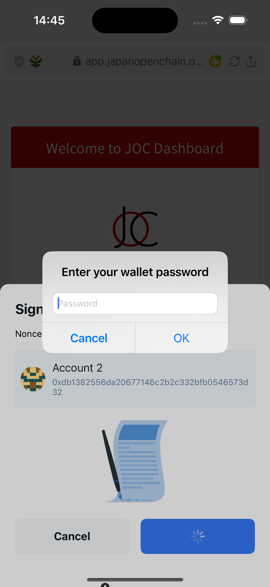

Lunascape supports 4 signing methods: Personal Sign, Sign Typed Data, Sign Typed Data V3, Sign Typed Data V4

## Send transaction

When a user makes a send transaction on the DApp, a transaction confirmation popup will be displayed.

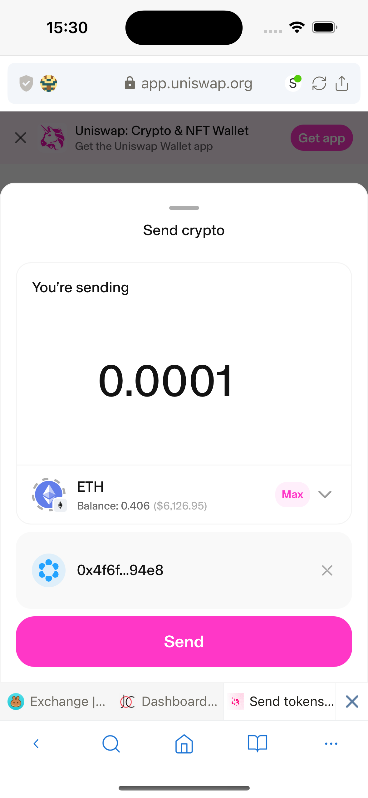

Or when the user performs a Swap operation, a transaction confirmation popup will also be displayed.

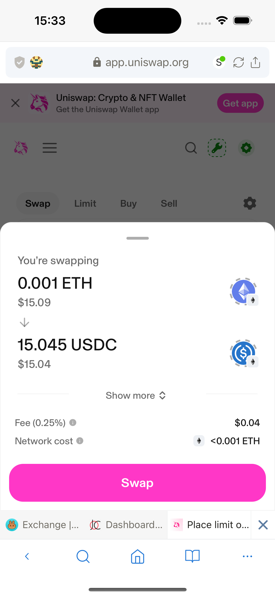

In the transaction confirmation popup, users can set the desired transaction fee.

Lunascape has calculated 3 values: Slow, Average, Fast based on the selected network. By default, the Average value is selected.

Users can also adjust the transaction fee manually by clicking the Advanced Settings button in the Transaction Fee Setting popup.

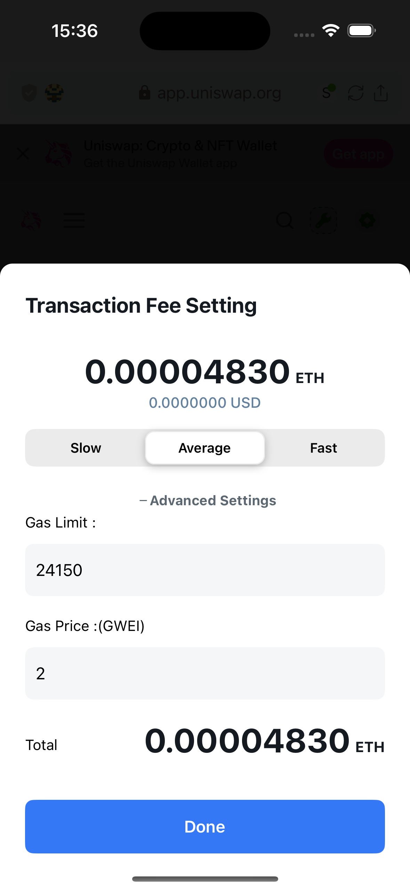
