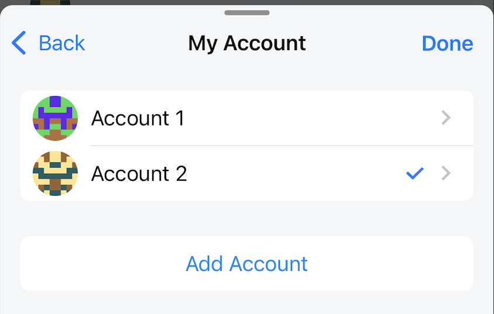
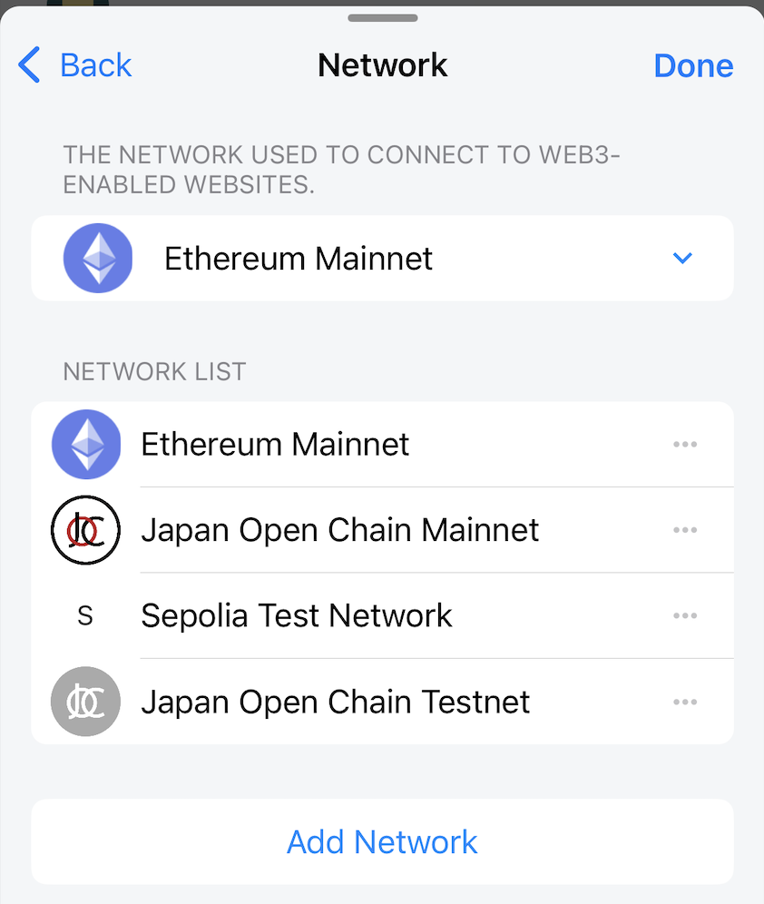
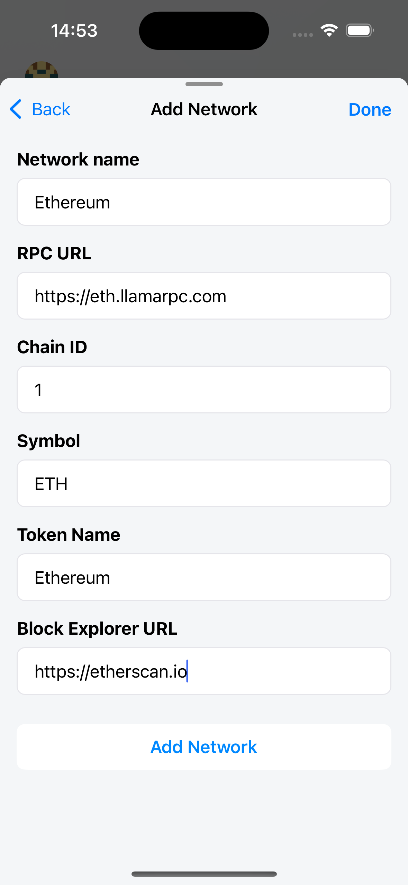
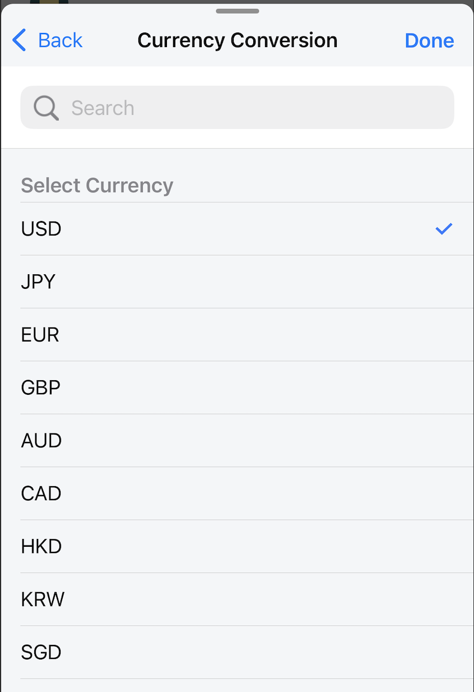
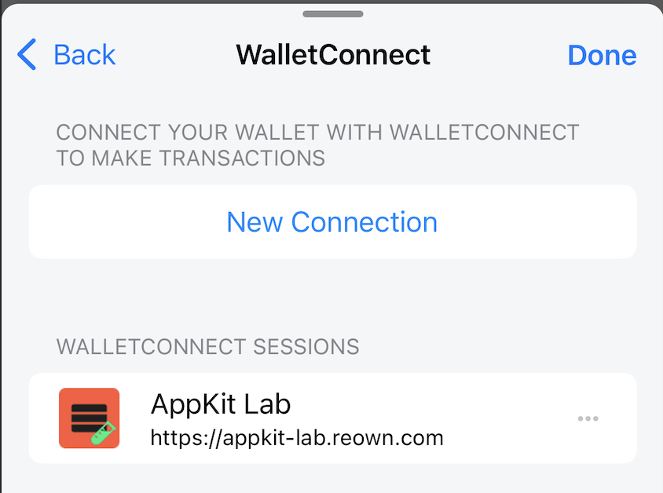
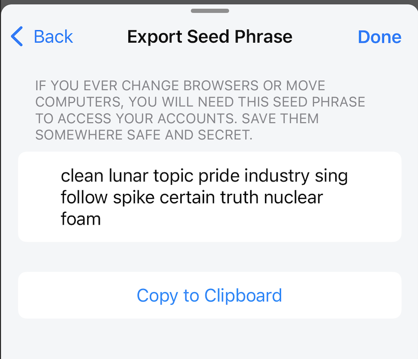
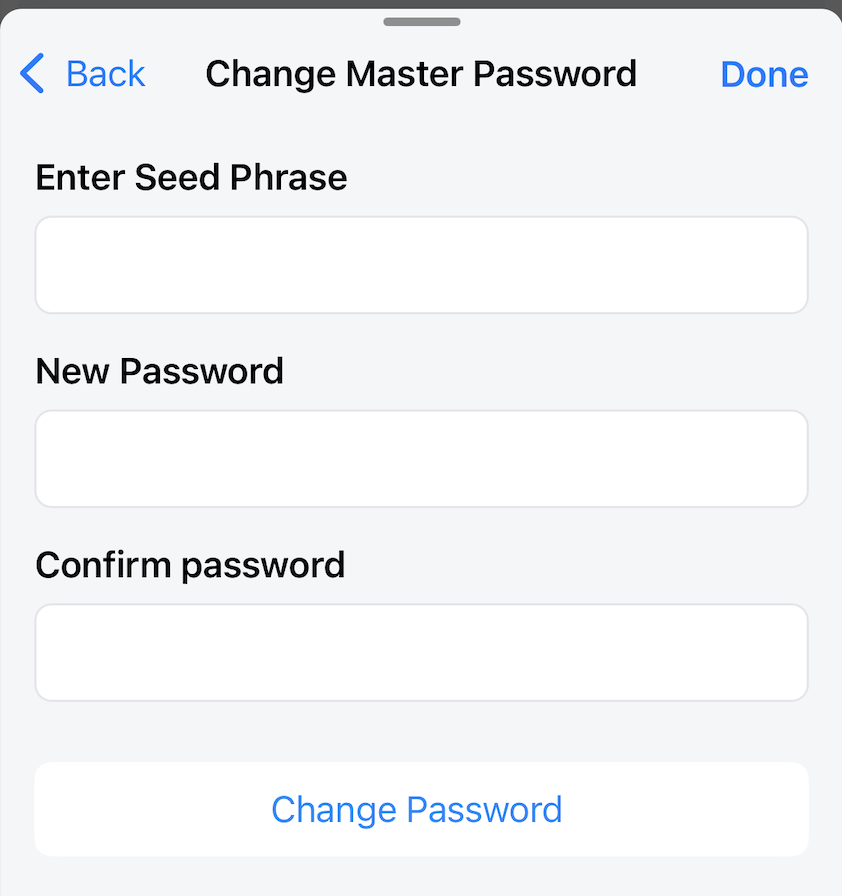
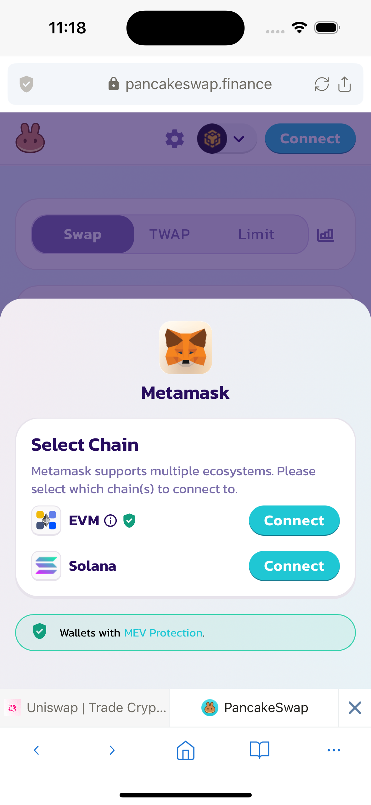

# Wallet Settings

## Account

Displays a list of existing accounts and the currently selected account.

Users can add one or more accounts to the wallet.
Lunascape supports 2 forms of adding new accounts:

- Create Account: create a new account from the Seed phrase in use.
- Import Secret Key: create a new account from private key.

**Account Detail**

Information displayed on the account details screen:

- Account Name
- Address
- Private Key

Users can only edit the Account Name field.

The application supports Clipboard feature for the Address and Private Key fields for convenient use.

Users can also perform Delete Account operation here.

## Address Book

Display the Address Book list.

Users can add familiar addresses such as friends' or account addresses on other wallets.
With this feature, users can send tokens conveniently without worrying about confusion.

**Add Contact**

Supported fields:

- Name: mnemonic name
- Address
- Description: add detailed description for contact

## Network

Displays the list of added networks, and the currently selected network.

Users can perform select/add/edit network operations.

**Add network**

To be able to add a network, you need the following information:

- Network name (required): can be the correct network name or optional
- RPC URL (required)
- Chain ID (required): when you fill in the correct RPC URL, the Chain ID will be automatically obtained. You can still fill in manually.
- Symbol (required): of the native token of the network
- Token Name (required): of the native token of the network
- Block Explorer URL (optional)

For already added networks, users can only edit the Block Explorer URL field.

## Currency Conversion

Displays a list of supported fiat currencies.
The converted value of the token balance will be displayed in the selected fiat currency.

Currently, Lunascape supports 9 fiat currencies:

- USD
- JPY
- EUR
- GBP
- AUD
- CAD
- HKD
- KRW
- SGD

Users can change their fiat currency selection here.

## WalletConnect

Displays a list of WalletConnect Sessions.

Users can connect to the DApp via WalletConnect by clicking the New Connection button. A QR code scanning screen will be displayed.

Additionally, users can also connect to DApps via WalletConnect by clicking on the button with the QR Code Scan icon in the Home App or Wallet Dashboard.

At the WalletConnect screen, users can delete the currently connected session, by doing this the connection to the DApp via WalletConnect will also be canceled.

## Permitted websites

Displays a list of websites allowed to connect to the wallet and groups them by account.

When a user is active on a web DApp, and connects to a wallet account, a connection confirmation popup will be displayed, asking the user to grant permission to the website or not. If the user accepts, the url of that DApp website will be automatically added to the list of permitted websites.

For websites already on this list, subsequent visits to the web DApp will automatically connect the wallet account without user confirmation.

Therefore, users need to carefully confirm the DApp they want to connect to. If they find any insecurity, please remove that website from the list of Permitted websites.

Users can also add manually using the Add to List feature here.

## Export Seed Phrase

Shows the wallet Seed Phrase. So be very careful when opening this screen.

## Change Master Password

There are two ways to use this feature.

**Method 1: Use to reset your wallet password when you forget your wallet's current password.**

Lunascape supports Face ID/Touch ID login. Therefore, users can forget their wallet password and still use the wallet as usual. In this case, users can use this feature to reset the wallet password. By taking the current Seed phrase (see Export Seed Phrase) fill in the Enter Seed Phrase field and create a new password.

Users need to pay close attention to the following:

- The Change Master Password feature will recreate the wallet according to the filled Seed Phrase. Therefore, all data of the current wallet will be deleted including the wallet account list, token list, network list, transaction history. Please backup the necessary data before using this feature.
- If the user uses the current Seed Phrase and resets the password. The wallet accounts created by the Account -> Create Account method can be recreated later with the filled Seed Phrase.
- Wallet accounts created by the Account -> Import Secret Key method cannot be recreated from the Seed Phrase, so please carefully backup the private keys of these accounts.

**Method 2: Use to create a new wallet with a new Seed Phrase.**

Users can create a new wallet with a new Seed Phrase and reset the wallet password. But be careful to backup your current wallet data such as seed phrase, private key before doing so.

The attention are the same as the attention given in method 1 above.

## Unlock with Face ID / Touch ID (iOS only)

Lunascape supports users to open wallets using Face ID / Touch ID. This feature enhances security and enhance user experience.

## Send transaction with Face ID / Touch ID (iOS only)

By default, every time a user makes a transaction, the user needs to enter the wallet password to confirm the transaction.

Lunascape supports the feature of making transactions with Face ID / Touch ID to enhance security and enhance user experience.

## Enable ethereum.isMetaMask

*Default: false*

For some DApps like Uniswap, web3 wallets can be detected automatically and allowed to connect.

For such DApps, users can enable or disable ethereum.isMetaMask, it does not affect the connection of DApp and wallet.

But for some DApps like Pancakeswap, it will usually only show connection options to well-known, verified wallets. And may not show connection options to Lunascape wallet, so users cannot connect DApp and wallet.

In this case, the user needs to enable ethereum.isMetaMask.
The Lunascape wallet will now be detected by the DApp under the name of the MetaMask wallet. And can connect to DApp via MetaMask option shown above DApp.

*MetaMask is a popular, verified and highly trusted web3 wallet, and is allowed to connect to most DApps.*
