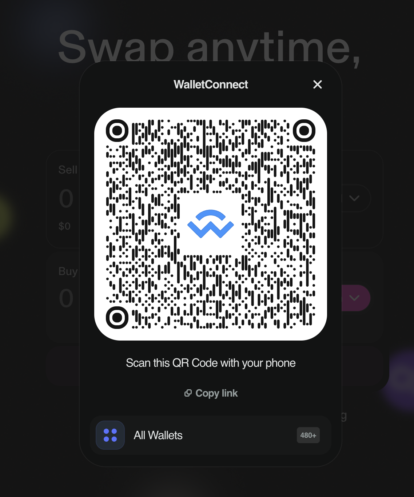
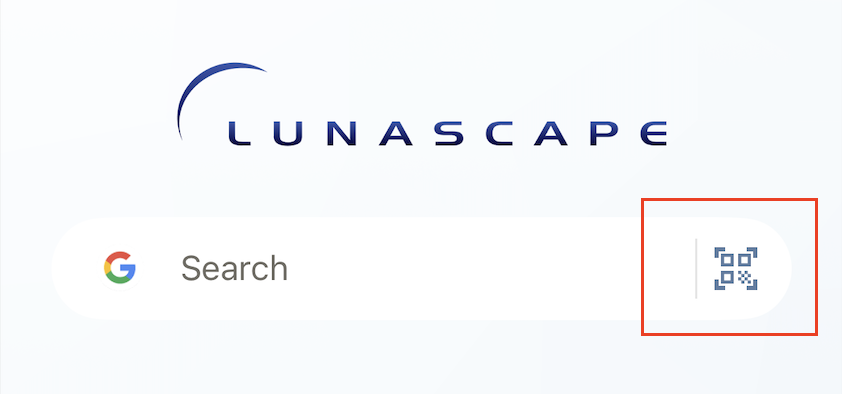
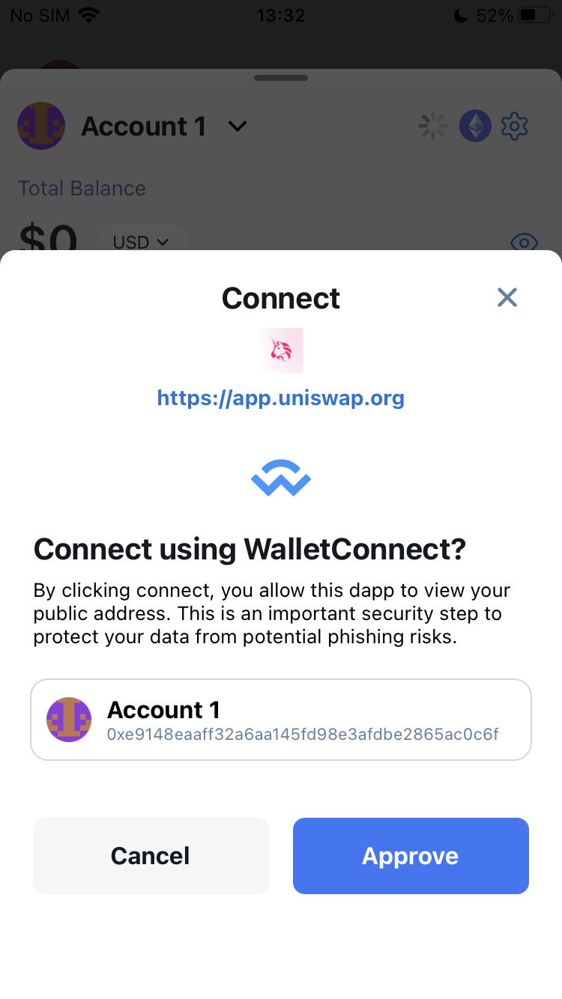
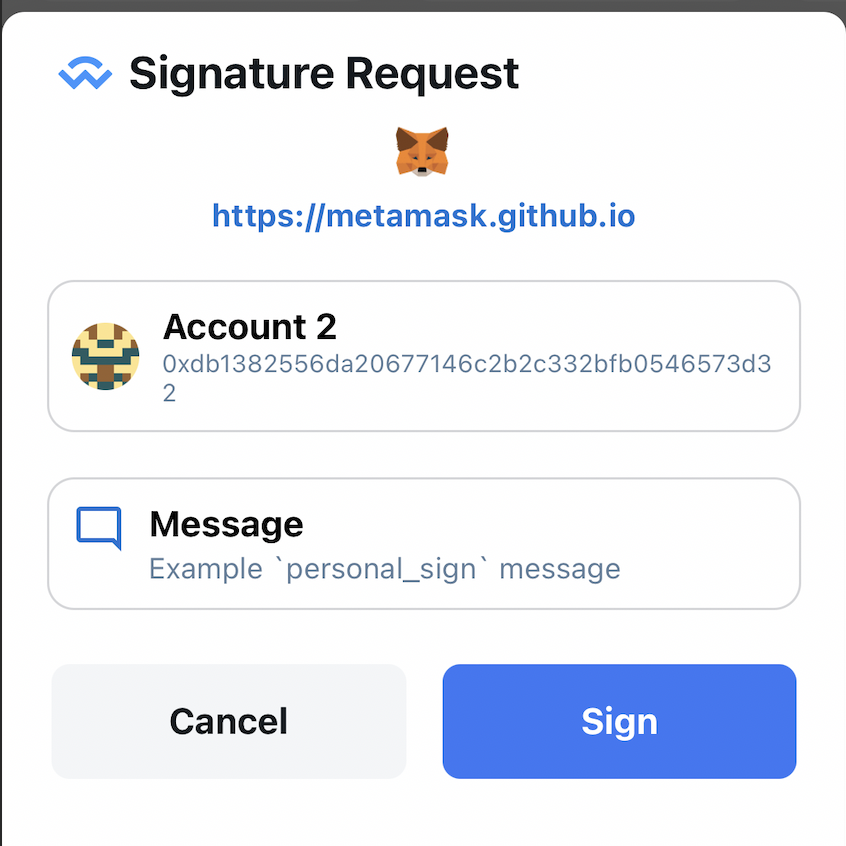
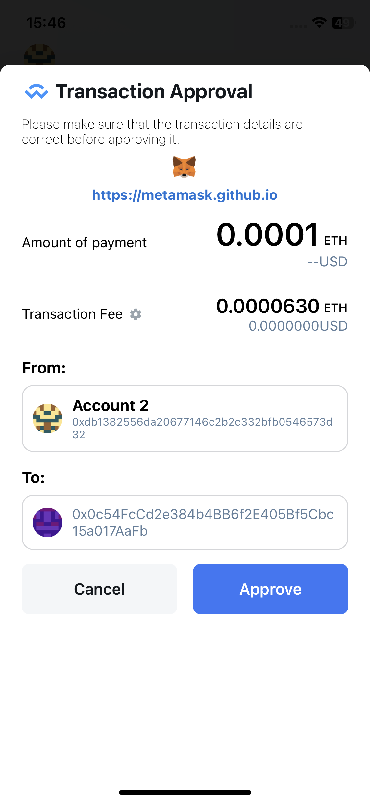

# WalletConnect

WalletConnect is an **open source protocol** that enables secure connection between crypto wallets and decentralized applications (dApps) via QR codes or deep links. It allows users to sign transactions and authenticate without sharing private keys directly with the dApp.

Read details here: [https://walletconnect.network/](https://walletconnect.network/)

Lunascape app fully supports WalletConnect both QR codes and Deep links

## Connect to DApp via QR code

In the DApp, users choose to connect to the wallet via WalletConnect. A connection QR code will be generated and displayed.

In Lunascape application, users click on the button with the QR code scan icon on

Home screen

Or Wallet/Dashboard

Then scan the QR code to connect. A connection confirmation popup will be displayed for the user to confirm.

## Connect to DApp via Deep link

On DApp, go to Lunascape wallet to connect.

When clicking on the Lunascape wallet, a popup confirming opening the Lunascape app is displayed. The user clicks Open to open the Lunascape app and make the connection.

When the Lunascape app is opened, a popup confirming the connection to the DApp is displayed. The user confirms the connection.

## WalletConnect Sessions

When successfully connected to DApp via WalletConnect, a session will be created.
Users can check the list of connected sessions at Wallet->Settings->WalletConnect.

On the WalletConnect screen, users can delete the connection session. When the user deletes the session, the DApp will automatically disconnect from the wallet.

On the contrary, in DApp, when the user disconnects from the wallet, the connected session will also be automatically removed from the list in the WalletConnect screen of the Lunascape application.

## Sign the transaction

Lunascape supports the following signature types:

- Personal Sign

- Sign Typed Data

- Sign Typed Data V3

- Sign Typed Data V4

## Send transaction

When a user makes a transaction on the DApp, a confirmation popup will be displayed on the Lunascape app for confirmation.

Currently Lunascape only supports Legacy Transaction.

EIP1559 Transaction will be supported in future versions.

## Switch Network

When the DApp changes network, a network switch confirmation popup is displayed for the user to confirm.

