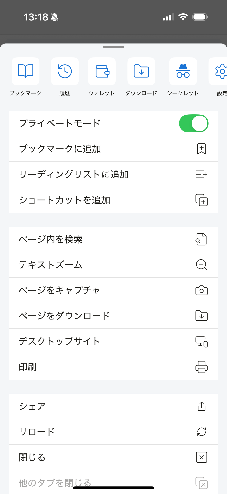

# ブラウザツールメニュー

ユーザーのウェブブラウジング体験を向上させるためのさまざまなツールを提供します。

- ブックマークに追加
- リーディングリストに追加
- ショートカットに追加
- ページ内検索：ウェブページ上の単語を検索

- テキストズーム：パーセンテージでテキストサイズを変更

- ページをキャプチャ：現在のウェブページのスクリーンショットを撮影し、画像は /Downloads フォルダーに保存されます
- ページをダウンロード：現在のウェブページの HTML をダウンロードします。直接の PDF ファイルリンクの場合は、PDF ファイルをダウンロードします
- デスクトップサイト / モバイルサイト：ウェブサイトのデスクトップ/モバイル表示を変更
- 印刷：プリンターに接続して現在のウェブページを印刷
- 共有
- 再読み込み
- 閉じる：現在のタブを閉じる
- 他のタブを閉じる：現在のタブを除くすべての開いているタブを閉じる
