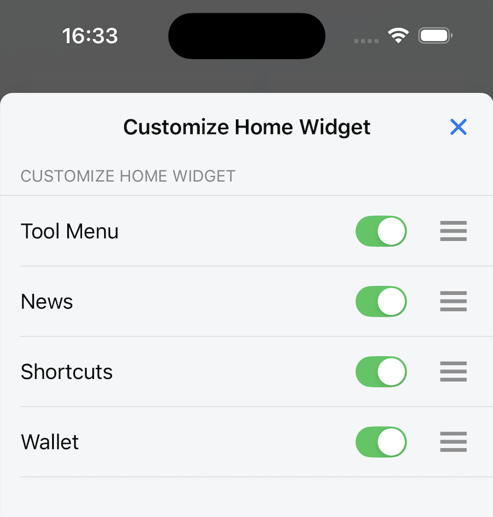

# 概要

## 目次

- [クイック検索](quick-search) - インストールされた検索エンジンとQRコードスキャンを使用した検索
- [ツールメニュー](tool-menu) - ブックマーク、履歴、ウォレット、ダウンロード、設定へのクイックアクセス
- [ニュース](news) - RSSフィード記事とニュースショートカット
- [ブラウザショートカット](browser-shortcuts) - ショートカット設定とインストールされたWebサイトへのクイックアクセス
- [ウォレット](wallets) - アカウント残高とトークン情報を含むWeb3ウォレット

## このセクションでカバーする内容

このセクションでは、Lunascapeのホーム画面機能の使用方法を説明します。以下の方法を学びます：

- 高速検索とQRコードスキャンのためのクイック検索ウィジェットの使用
- ツールメニューを通じた各種ブラウザ機能へのアクセス
- ニュースウィジェットを通じたニュースの更新
- ブラウザショートカットの作成と管理
- 内蔵Web3ウォレット機能の使用

各ウィジェットは、お好みと使用パターンに合わせてカスタマイズできます。

ホーム画面は、基本的な機能へのクイックアクセスのために、クイック検索、ツールメニュー、ニュース、ショートカット、ウォレットなどのウィジェットを提供します。

各ウィジェットの位置と表示をカスタマイズできます。

