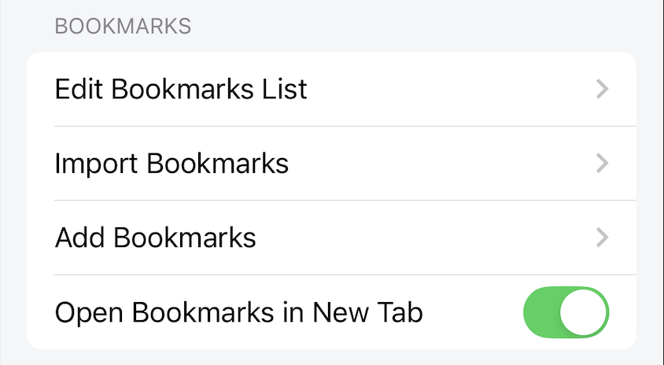
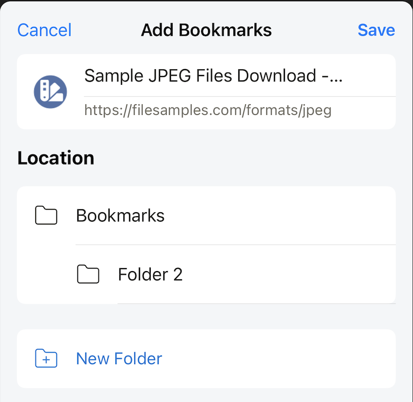

# ブックマーク設定

ブックマークの設定

## ブックマークリストを編集

ブックマークモーダルを開き、ユーザーはここでブックマークリストを追加/編集/削除できます。

## ブックマークをインポート

ユーザーはSafariなど、ブックマークエクスポート機能をサポートするブラウザからブックマークをインポートできます。他のブラウザからブックマークをすばやく移動することをサポートします。

## ブックマークを追加

ブックマークを追加モーダルを開き、ユーザーは開いているWebサイトをブックマークリストに追加できます。

## 新しいタブでブックマークを開く

有効にすると、ブックマークをクリックすると、Webサイトが新しいタブで開かれます。

無効にすると、ブックマークをクリックすると、Webサイトが現在のタブで読み込まれます。

*デフォルト：有効*
