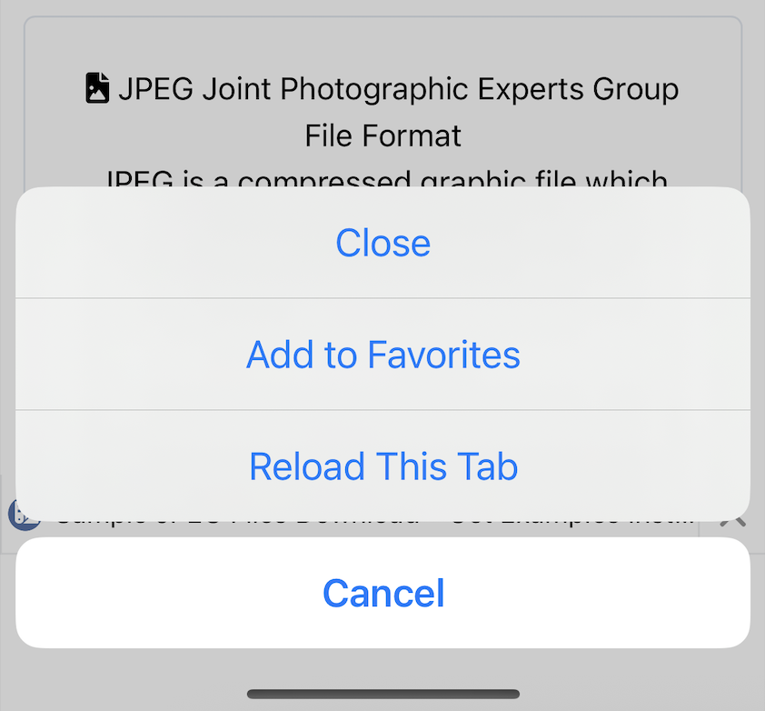
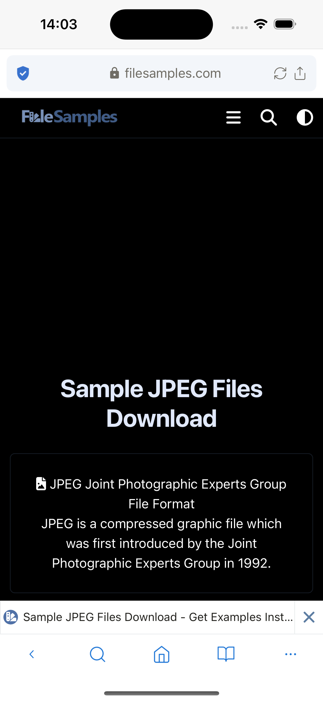

# 表示設定

表示に関連する設定。

## ツールバーとタブバー

**タブバーを表示**

有効にすると、タブバーが表示されます。

無効にすると、タブバーは表示されず、代わりに現在開いているタブの数が表示されます。

*デフォルト：有効*

**ツールバーを自動非表示**

有効にすると、Webページで下にスクロールすると、タブバー/ツールバーが非表示になり、Webページの表示領域が増加します。上にスクロールすると、タブバー/ツールバーが再び表示されます。

無効にすると、Webページで上下にスクロールしても、ツールバー/タブバーは常に表示されます。

*デフォルト：有効*

**単一タブのタブバーを自動非表示**

有効にすると、1つのタブのみが開いている場合、タブバーが非表示になります。

無効にすると、タブバーは「タブバーを表示」設定に従って非表示/表示されます。

*デフォルト：無効*

**長押しでタブメニューを有効にする**

有効にすると、タブバーをタップしてホールドすると、タブメニューが表示されます。

*デフォルト：有効*

## ブックマークと履歴

**モーダルスタイル**

ブックマークと履歴モーダルを開く際の2つのレイアウトスタイルを提供：ハーフとフル

*デフォルト：ハーフ*

## テーマ

Lunascapeアプリケーションのテーマをインストール（ブラウザで閲覧するWebページは除く）。

2つのタイプのテーマを提供：デフォルト（ライト）とブラック。

***ダークモードを使用***設定に応じて、設定は異なる動作をします。
***ダークモードを使用***は、電話システムがダークモードを使用することを意味します。

***ダークモードを使用***はデフォルトで無効です。現在、電話システムがダークモードまたはライトモードに設定されているかに関係なく、アプリケーション内のテーマは最初のデフォルト/ブラックテーマブロックの設定に従います。

***ダークモードを使用***が有効で：

- 電話システム設定がライトモードの場合、アプリテーマは最初のデフォルト/ブラックテーマブロックの設定に従います。
- 電話システム設定がダークモードの場合、アプリテーマは最後のデフォルト/ブラックテーマブロックの設定に従います。

*デフォルトテーマ：デフォルト*

## ナイトモード

***ナイトモード***は、ブラウザで閲覧するWebサイトのみのテーマ設定です。
***テーマ***は、ブラウザで閲覧するWebサイトを含まないLunascapeアプリケーションのテーマ設定です。
これらは異なる部分の2つの設定で、個別に動作します。

無効にすると、ダークモードはWebサイトに適用されません。

有効にすると、ダークモードがWebサイトに適用されます。

*デフォルト：無効*

## 言語

アプリケーションの言語を設定します。現在20の異なる言語をサポートしています。

*デフォルト：アプリケーションインストール時のシステム言語に従う*

## テキストズーム

テキストズームが設定されたドメインのリストを保存します。
各ドメインには異なるスケールを設定できます。
ユーザーはここでインストールされたドメインを削除でき、そのドメインのテキストズームスケールは通常に戻ります。

## ユーザーエージェント

ユーザーはモバイルサイトとデスクトップサイズビューの異なるユーザーエージェントを設定できます。

ユーザーはユーザーエージェントをデフォルトにリセットすることもできます。

*デフォルト*

*モバイルサイト：Mozilla/5.0 (iPhone; CPU iPhone OS 18_0 like Mac OS X) AppleWebKit/605.1.15 (KHTML, like Gecko) Version/18.0 Mobile/15E148 Safari/604.1*

*デスクトップサイト：Mozilla/5.0 (Macintosh; Intel Mac OS X 10_15_7) AppleWebKit/605.1.15 (KHTML, like Gecko) Version/17.5 Safari/605.1.15*

**アプリを開くときにユーザーエージェントをリセット**

有効にすると、アプリケーションが再起動されるたびに、すべてのユーザーエージェントがデフォルトに設定されます。

無効にすると、アプリケーションが再起動されるたびに、インストールされたすべてのユーザーエージェントが保持されます。

*デフォルト：有効*
