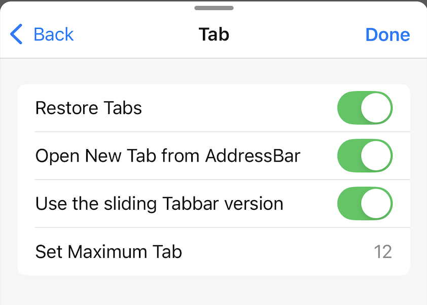
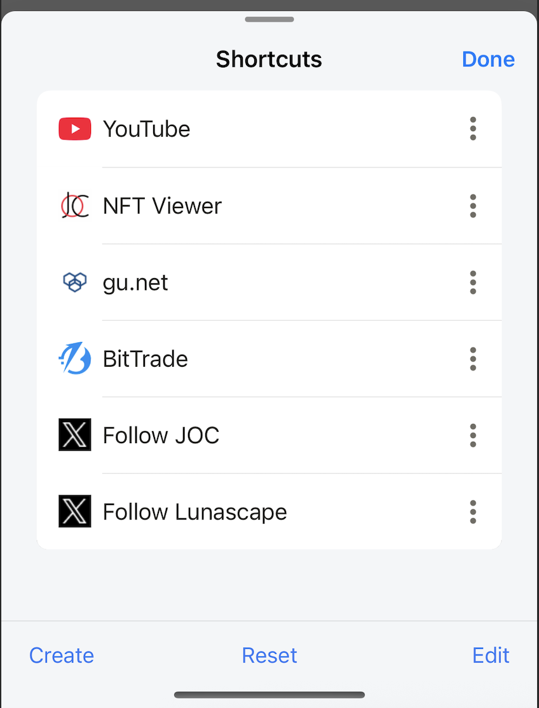
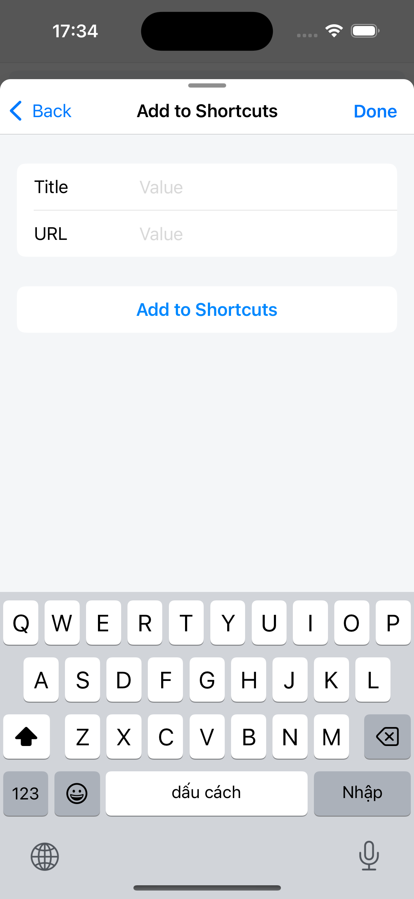
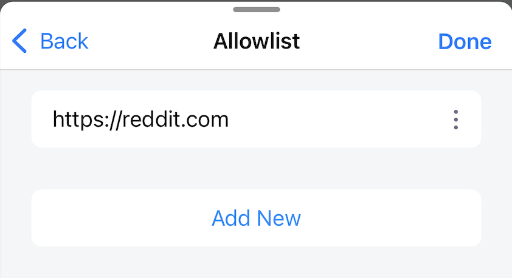

# 一般設定

ホーム、タブ、ブラウザ、ウィジェットの一般的なカスタマイズ。

## アクション

**回転ロック**

有効にすると、アプリは常に縦向きモードになります。

無効にすると、アプリは電話を回転させたときに縦向き/横向きモードに変わります。ただし、電話のシステム設定が回転ロックの場合、アプリは常に縦向きモードになります。

*デフォルト：無効*

**トップにスクロール（iOSのみ）**

有効にすると、右上角のステータスバーエリアをタップすると、Webサイトが自動的にページのトップにスクロールします。

*デフォルト：有効*

**写真アルバム/ギャラリーに画像を保存**

無効にすると、「画像を保存」は画像を/Downloadsフォルダに保存します。
有効にすると、「画像を保存」は画像を写真アルバム/ギャラリーに保存します。

*デフォルト：無効*

## タブ

**タブを復元**

有効にすると、アプリケーションを再起動すると、以前に開いたタブが再び開かれます。

無効にすると、アプリケーションを再起動しても、以前に開いたタブは再び開かれません。

*デフォルト：有効*

**アドレスバーから新しいタブを開く**

有効にすると、現在のタブのアドレスバーをタップして検索語またはリンクを入力し、Enterを押すと、結果/Webサイトが新しいタブで開かれます。

無効にすると、現在のタブのアドレスバーをタップして検索語またはリンクを入力し、Enterを押すと、結果/Webサイトが現在のタブに読み込まれます。

*デフォルト：有効*

**スライディングタブバーバージョンを使用**

有効にすると、スライディングタブバーが使用され、タブバーでスワイプして表示されるタブを選択します。

無効にすると、通常のタブバーが使用され、タブバーはリスト形式になり、水平スクロールでタブを選択します。

*デフォルト：有効*

**最大タブ数を設定**

同時に開くことができるタブの最大数を設定します。
設定できる最小値は6、最大値は30です。
ユーザーが12より大きい値を設定すると、警告が表示されます。値が大きすぎる設定はお勧めしません。アプリケーションのパフォーマンスとブラウジング体験に影響します。

*デフォルト：12*

## ショートカット

**ショートカットリストを編集**

ショートカットモーダルを開き、ユーザーは以下の操作を実行できます：

- 新しいショートカットを作成
- ショートカットリストをデフォルトにリセット
- ショートカットの位置を変更
- ショートカットを削除

**ショートカットに追加**

ショートカットに追加画面を開き、ユーザーはここで新しいショートカットを作成できます。

**新しいタブでショートカットを開く**

有効にすると、ショートカットをタップすると、Webサイトが新しいタブで読み込まれます。
無効にすると、ショートカットをタップすると、Webサイトが現在のタブで読み込まれます。

*デフォルト：有効*

## 広告ブロッカー

**広告ブロッカーを有効にする**

有効にすると、広告ブロックが機能しますが、許可リストのWebサイトでは機能しません。

無効にすると、広告ブロックは機能しません。

*デフォルト：無効*

**許可リスト**

広告機能が機能しないWebサイトのリストを設定します。

ユーザーはリストから手動で追加/削除できます。

## ニュース

ニュースリストを設定します。ユーザーはRSSフィードを追加/編集/削除できます。
各RSSフィードは、ニュース画面のニュースページに対応します。ユーザーは希望に応じてニュースページの位置を変更できます。
各言語には異なるデフォルトのRSSフィードリストがあります。
フィードをリセットすると、現在の言語に応じてRSSフィードリストがデフォルトにリセットされます。

## ツールメニューをカスタマイズ

ホーム画面に表示されるツールメニューリストの位置、非表示/表示を設定

## ホームウィジェットをカスタマイズ

ホーム画面に表示されるウィジェットの位置、非表示/表示を設定

