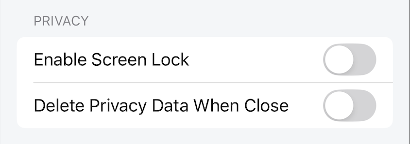

# プライバシー設定

プライバシーの設定

## スクリーンロックを有効にする（iOSのみ）

有効にすると、アプリケーションはスクリーンロックで保護され、アプリケーションの全コンテンツがスクリーンロックで覆われます。バイパスするには、ユーザーはデバイスの顔認証/タッチID/パスコードを使用する必要があります。

デフォルト：無効

## 閉じるときにプライバシーデータを削除

有効にすると、アプリケーションが閉じられるたびに、すべてのユーザーブラウジングデータが削除されます。

影響を受けるデータ：ブラウジング履歴、検索履歴、Web Cookie、Webキャッシュ。

デフォルト：無効
