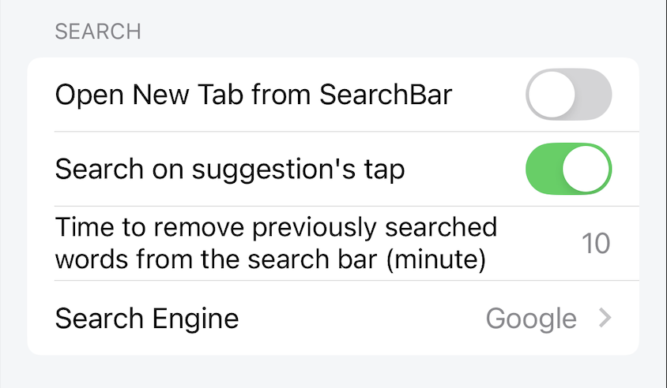

# 検索設定

検索の設定

## 検索バーから新しいタブを開く

有効にすると、検索結果が新しいタブで開かれます。

無効にすると、検索結果が現在のタブで直接読み込まれます。

*デフォルト：有効*

## 提案のタップで検索

有効にすると、ユーザーが検索提案をクリックすると、検索アクションが実行されます。

無効にすると、ユーザーが検索提案をクリックすると、検索提案が検索入力ボックスに入力されますが、検索アクションは実行されません。

*デフォルト：有効*

## 検索バーから以前に検索した単語を削除する時間（分）

検索語が検索入力に存在する時間を設定します。つまり、設定時間中、ユーザーが検索入力を開くと、以前の検索語がまだそこに入力されています。設定時間後、以前の検索語が削除され、検索入力が空になります。

最大時間値は60分です。最小時間値は0分です。

*デフォルト：10分*

## 検索エンジン

Lunascapeは8つの検索エンジンを提供します：

- Google
- Bing
- Amazon
- Youtube
- Twitter/X
- Wiki
- DeepL
- ebay

検索結果は、検索時にユーザーが選択する検索エンジンによって異なります。

*デフォルト：Google*
