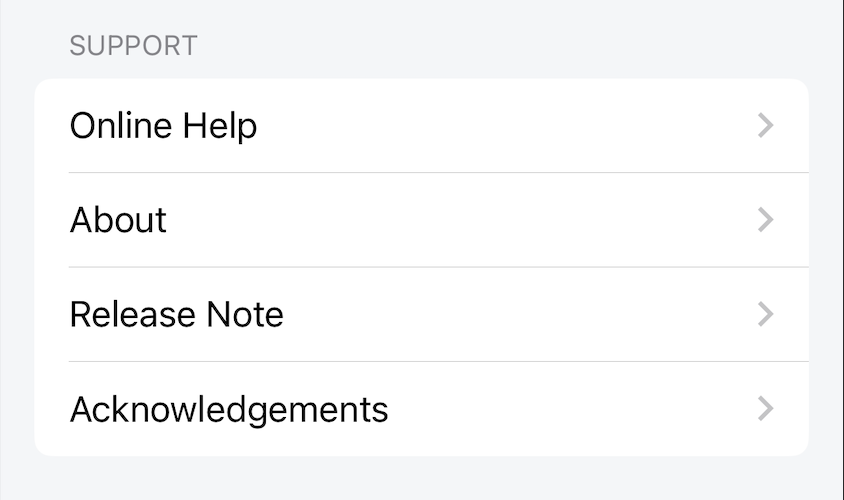
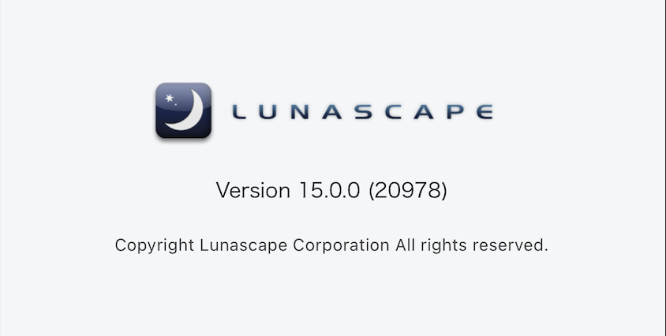
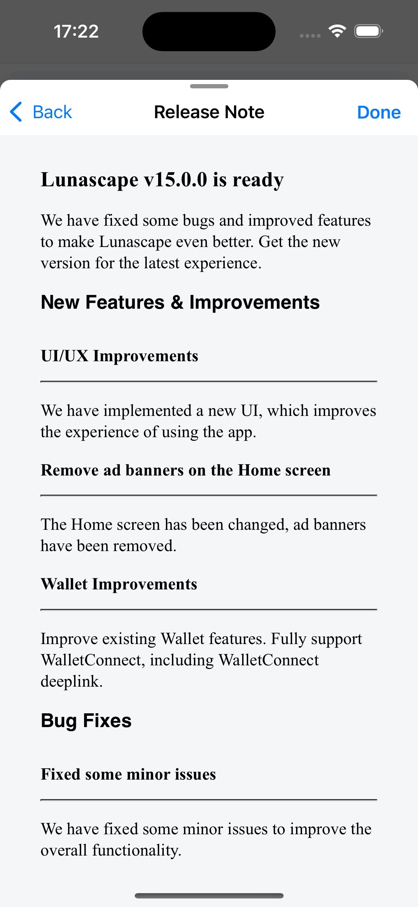

# サポート設定

## オンラインヘルプ

ブラウザでLunascapeアプリの[FAQ](https://help.gu.net/lunascape-for-mobile-faq)ページを開きます。ユーザーはここで一般的な問題を調べることができます。

## について

アプリケーションの現在のバージョンを紹介します。

## リリースノート

前のバージョンと比較した現在のバージョンのすべての変更を紹介します。

## 謝辞

Lunascapeは多くのオープンソースライブラリに基づいて構築されています。これは、Lunascapeが使用するすべてのライブラリのオープンソースライセンスを表示する画面です。

