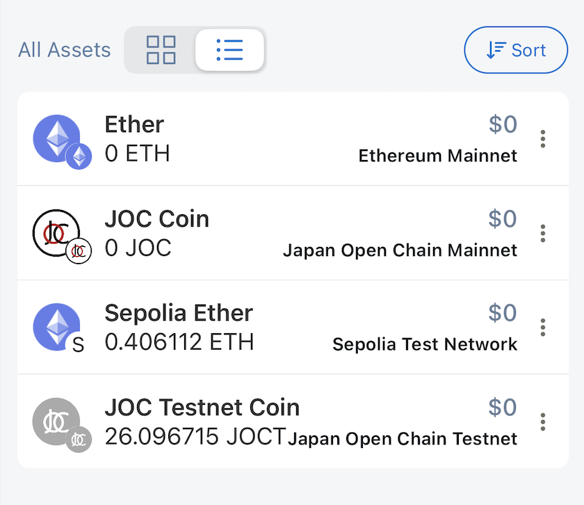
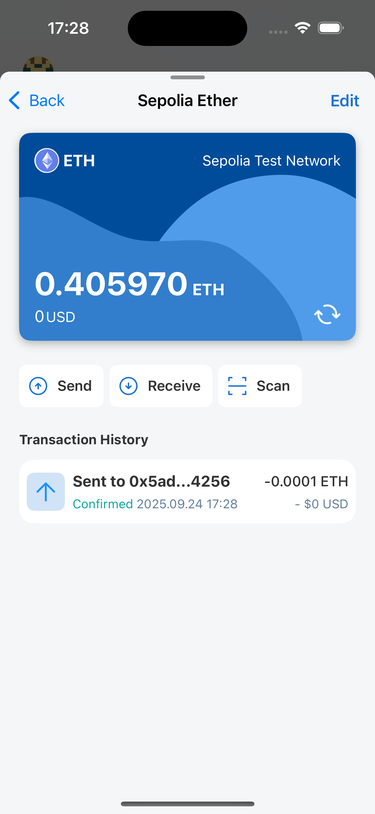

# アセット一覧

これは、現在選択されているウォレットの残高情報とすべてのトークン、およびいくつかの他の機能を表示する画面です。

## 総残高

ダッシュボード/総残高と同じ

## すべてのアセット

Lunascapeは2つのタイプのリストをサポートしています：カードとリスト。

カード

リスト

サポートされている並び替えタイプ：

- デフォルト：最後に表示されたトークンがリストの上部に表示されます
- アルファベット順（A-Z）
- 残高減少（$高-低）

ユーザーはトークンの編集/削除操作も実行できます

## トークン詳細

トークン情報を表示：

- トークン名
- トークンシンボル
- トークン残高
- 対応する法定通貨価値
- トークンネットワーク
- 取引履歴

ユーザーは表示されたトークンでクイックアクションも実行できます：

- 送信
- 受信
- スキャンして送信

## トークンを編集

アプリケーションはユーザーが2つの値のみを編集することを許可します：

- 表示用の小数点以下桁数
- カードカラー

