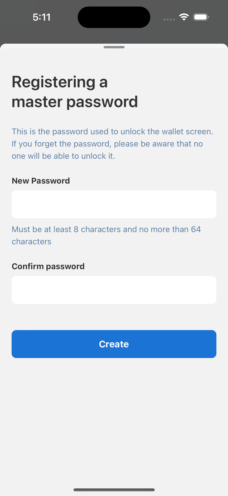

# ウォレット作成

ユーザーは新しいウォレットを作成するか、シードフレーズを使用して既存のウォレットをインポートできます。

ユーザーは8文字から64文字に制限された任意のパスワードを作成できます。

現在、Lunascapeは1つの秘密鍵管理方法のみを提供しています：セルフカストディ。ウォレットのすべてのシードフレーズと秘密鍵は、電話のキーチェーンに保存され、自己保存されます。キーチェーンについて、これは電話の安全なストレージ領域で、データセキュリティを確保するために暗号化されています。

新しいウォレットを作成

または既存のウォレットのシードフレーズをインポート

ウォレットの作成に成功した後に選択されるデフォルトネットワークはEthereum Mainnetです。
