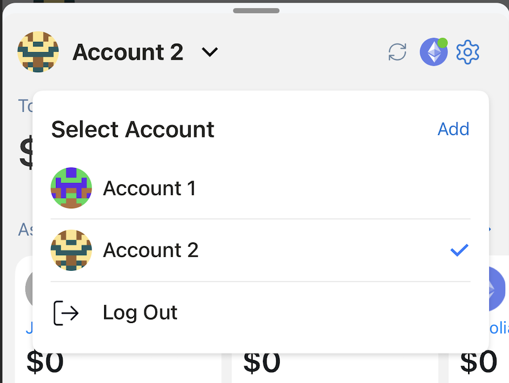
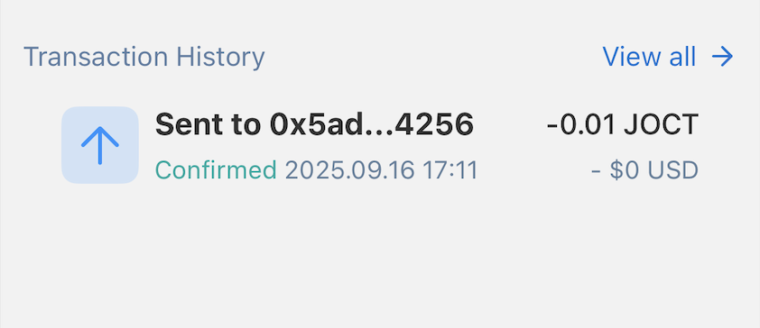
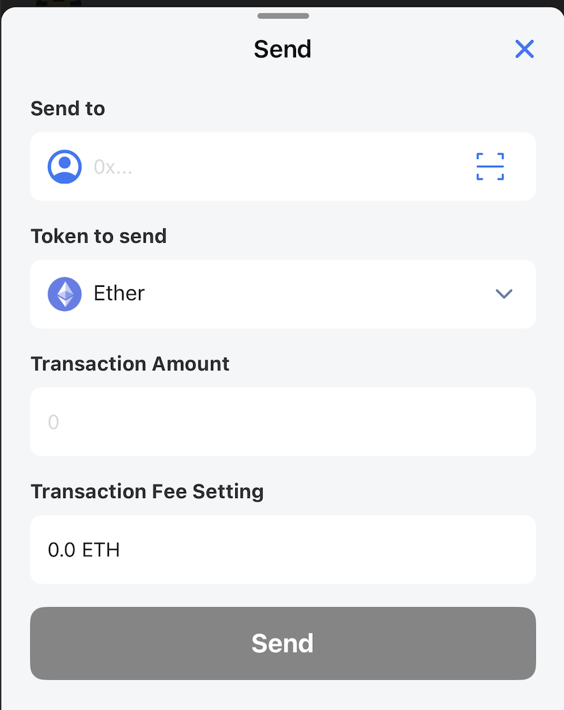
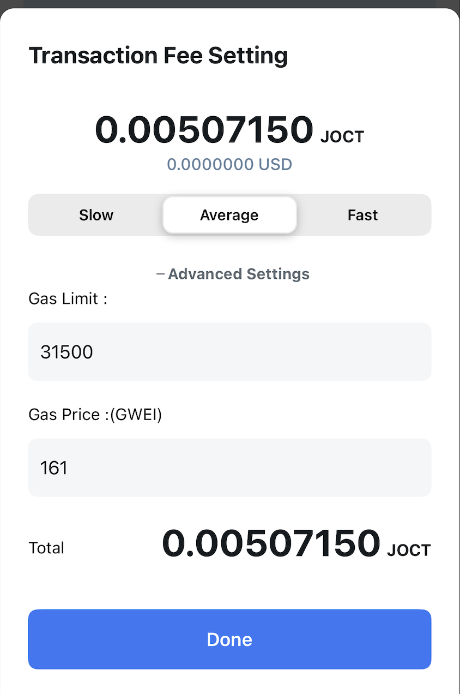

# ウォレットダッシュボード

選択されたアカウントの概要情報が表示されます：アカウント名、ネットワーク、総残高、アセット、取引履歴、フッター。

## アカウント名

アカウント名が上部に表示されます。

ユーザーはここをクリックしてアカウントを切り替え、新しいアカウントを追加するか、ウォレットをロックできます。

## ネットワーク

選択されたネットワークのアイコンが上部の右側に表示されます。
ユーザーはここでネットワークを切り替えたり、新しいネットワークを追加したりできます。

## 総残高

選択された法定通貨での現在のアカウントの総残高を表示します。9つの法定通貨がサポートされています。
ユーザーはプライバシーのためにこの値を非表示/表示できます。

## アセット

現在のアカウントのトークンリストを表示します。デフォルトでは、最後に使用されたトークンがリストの上部に表示されます。

## 取引履歴

現在のアカウントの最新の取引が表示されます。このリストには送金取引のみが表示されます。受信取引はサポートされていません。

## 取引を送信

ユーザーはフッターの送信ボタンをクリックして送信画面にアクセスできます。

送信画面で、ユーザーは受信するウォレットアドレスと送信するトークンを選択します。

アプリケーションはアドレス帳機能をサポートしています - ユーザーが知っているウォレットアドレス連絡先を保存する場所で、取引をより便利で正確にするのに役立ちます。

ユーザーはQRコードでウォレットアドレスをスキャンすることもできます。

ユーザーは取引手数料を調整できます。アプリケーションは自動的に3つの設定をサポートします：スロー/平均/高速ですが、ユーザーは希望する値を指定することもできます。

## 取引を受信

現在の受信ウォレットアドレスを表示するには、フッターの受信ボタンをクリックします。

アプリはウォレットアドレスのコピーとQRコードの両方をサポートしています。

## クイックスキャンQRコード

フッターのQRスキャンアイコンをクリックして、WalletConnectを使用したウォレット接続、スキャンされたウォレットアドレスへのトークン転送などのアクションを実行できます。

