# DAppでのウォレット操作

## ウォレットを接続

DAppで、接続ボタンをクリックして接続ウォレットオプションを表示します。Lunascapeを選択すると、接続確認ポップアップが表示され、ユーザーが接続を確認します。

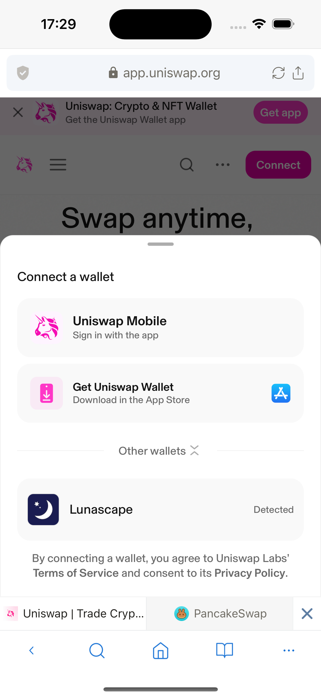

Pancakeswapなどの一部のDAppでは、Lunascapeウォレットが接続ウォレットのリストに表示されない場合があります。ethereum.isMetaMaskを有効にし、Metamaskウォレットの名前で接続してください。

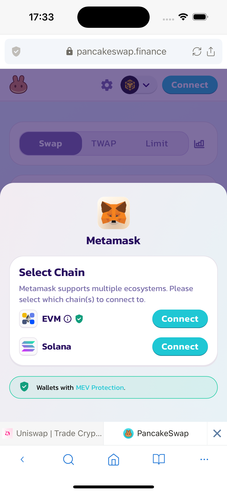

## トークンを追加

ウォレットに新しいトークンを追加する方法は2つあります。

### 方法1：トークンを手動で追加

アセット一覧画面で、追加ボタンをクリックします。アセット追加画面が表示されます。

トークンタイプが**ベース通貨**の場合、ユーザーは対応するネイティブトークンを追加するために**ネットワーク**を選択するだけです。

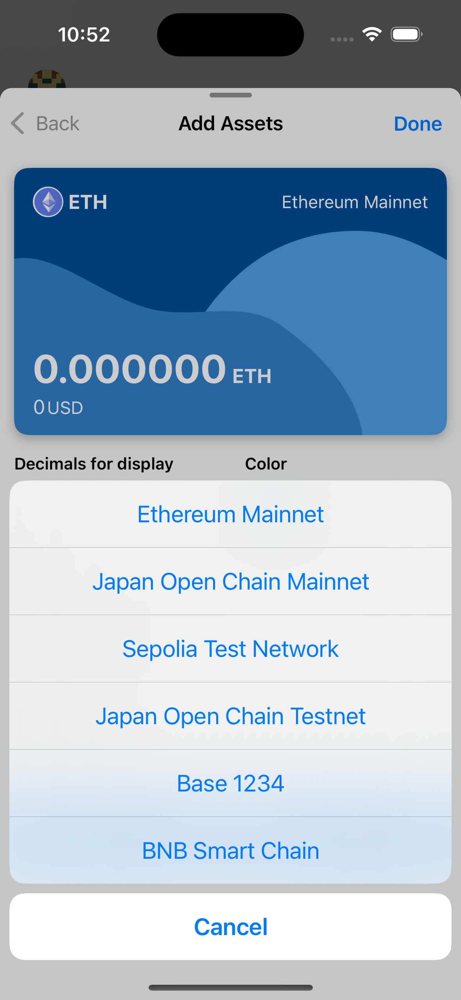

トークンタイプが**ERC-20**の場合、ユーザーはアドレスフィールドに**コントラクトアドレス**を入力します。QRコードスキャン機能もサポートされています。
コントラクトアドレスを入力すると、トークン情報が自動的に表示されます：トークン名、シンボル、小数点以下桁数。

**注意**：ERC-20トークンは**1つまたは複数のコントラクトアドレス**を持つことができ、各アドレスはこのトークンがサポートされているネットワークに対応します。
例えば：USCは多くのネットワークでサポートされています：Ethereum、BNB Smart Chain、Solana、Polygon、... 対応するコントラクトアドレスは：

- Ethereumのコントラクトアドレス：0xa0b86991c6218b36c1d19d4a2e9eb0ce3606eb48
- BNB Smart Chainのコントラクトアドレス：0x8ac76a51cc950d9822d68b83fe1ad97b32cd580d
- Solanaのコントラクトアドレス：EPjFWdd5AufqSSqeM2qN1xzybapC8G4wEGGkZwyTDt1v

したがって、ユーザーが選択されたネットワークと間違ったコントラクトアドレスを入力すると、正しいトークン情報が取得されません。

最後に、ユーザーは**アセットを追加**ボタンをクリックして新しいトークンの追加プロセスを完了します。

### 方法2：DAppからトークンを追加

ユーザーは使用しているDAppから新しいトークンを追加できます。

例えば、ユーザーはCoinMarketCapから多くのトークンを検索して追加できます - これは有名で、正当で安全なWebサイトです。ここで、ユーザーは希望するトークンを検索し、**コントラクト**フィールドに移動できます。

次に、ウォレットで選択されたネットワークに対応するコントラクトアドレスに移動します。ウォレットでEthereumネットワークが選択されている場合、Ethereumネットワークのコントラクトアドレスに移動します。その後、MetaMaskアイコンをクリックします。

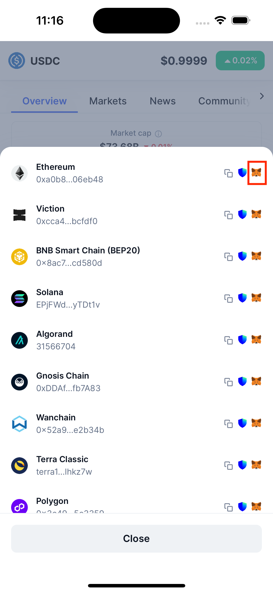

次に、CoinMarketCapへの接続許可を求めるポップアップが表示されます。以前に接続したことがある場合、接続許可を求めるポップアップは表示されません。

ユーザーが接続を確認した後、トークン追加ポップアップが表示されます。

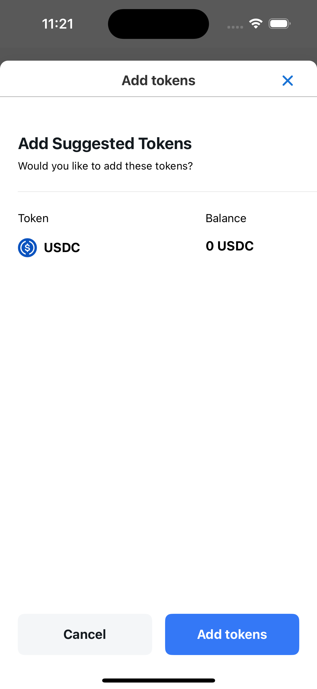

最後に、ユーザーは**トークンを追加**ボタンをクリックしてトークン追加プロセスを完了します。

## ネットワークを追加

ネットワークを追加する方法は2つあります

### 方法1：ネットワークを手動で追加

設定/ネットワーク/ネットワークを追加の指示を確認

### 方法2：DAppからネットワークを追加

DAppで、ユーザーがネットワーク変換を実行したり、ネットワークを追加したりし、そのネットワークがウォレットに存在しない場合、ネットワーク追加確認ポップアップが表示され、ユーザーがネットワークの追加を確認します。

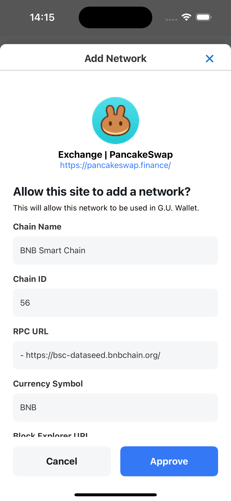

**注意**：新しいネットワークが追加されると、そのネットワークのネイティブトークン（ベース通貨）も自動的にウォレットに追加されます。

## ネットワークを切り替え

ユーザーがDAppでネットワークを切り替えると、ネットワーク切り替え確認ポップアップが表示されます。

逆に、ユーザーがウォレットでネットワークを切り替えると、DAppは自動的に対応するネットワークに切り替わります（この場合、確認ポップアップは表示されません）

以下の場合：ネットワークAがウォレットに追加されているが、ネットワークAのネイティブトークン（ベース通貨）がウォレットから削除されている。ユーザーがDAppでネットワーク切り替え操作を実行すると、まずネットワークのネイティブトークン追加確認ポップアップが表示され、ユーザーが確認した後、ネットワーク切り替え確認ポップアップが次に表示されます。

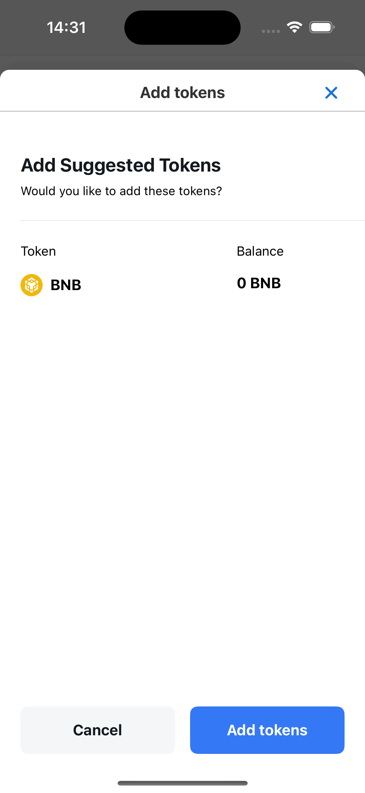

## 取引に署名

多くのDAppはウォレット経由でのログインをサポートしており、ユーザーがウォレット情報を使用してDAppでアクティブなアカウントを作成できることを意味します。

DAppをウォレットに接続した後、ユーザーはアカウント作成またはDAppの使用を確認するために取引に署名します。

ユーザーがDAppで署名ボタンをクリックすると、署名リクエストポップアップが表示され、ユーザーが確認します。

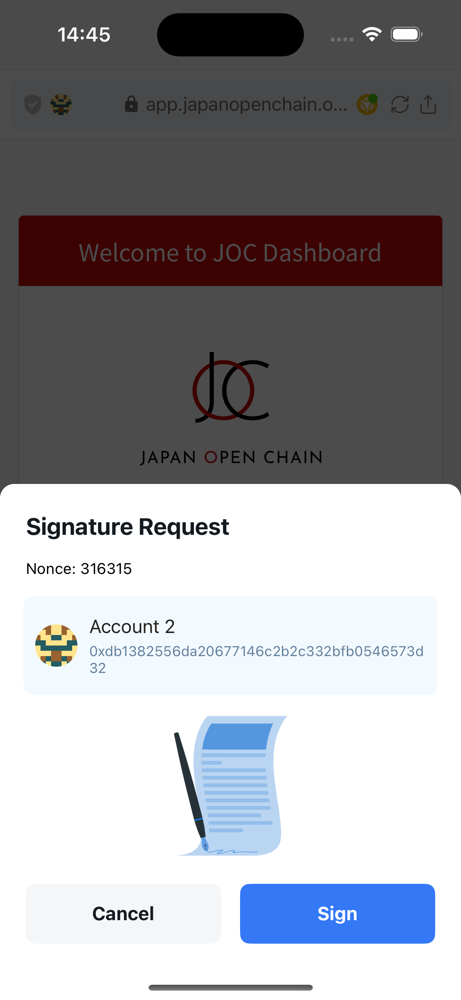

ユーザーは署名するためにウォレットパスワードが必要です。

Lunascapeは4つの署名方法をサポートしています：Personal Sign、Sign Typed Data、Sign Typed Data V3、Sign Typed Data V4

## 取引を送信

ユーザーがDAppで送信取引を行うと、取引確認ポップアップが表示されます。

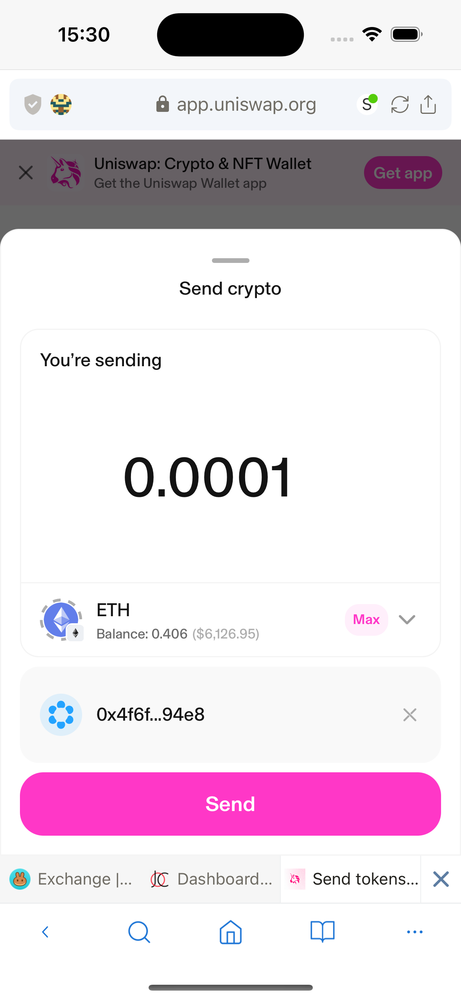

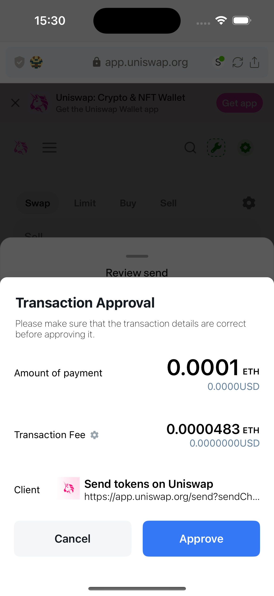

または、ユーザーがスワップ操作を実行すると、取引確認ポップアップも表示されます。

取引確認ポップアップで、ユーザーは希望する取引手数料を設定できます。

Lunascapeは選択されたネットワークに基づいて3つの値を計算しました：スロー、平均、高速。デフォルトでは、平均値が選択されています。

ユーザーは取引手数料設定ポップアップの詳細設定ボタンをクリックして、取引手数料を手動で調整することもできます。

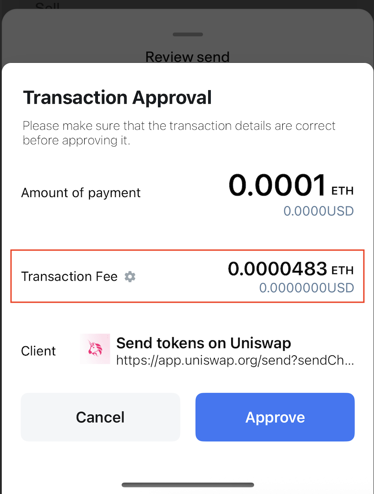

