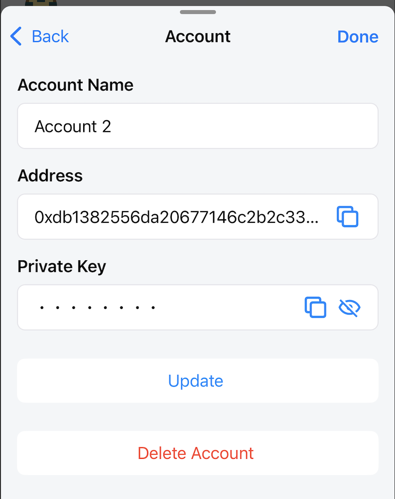
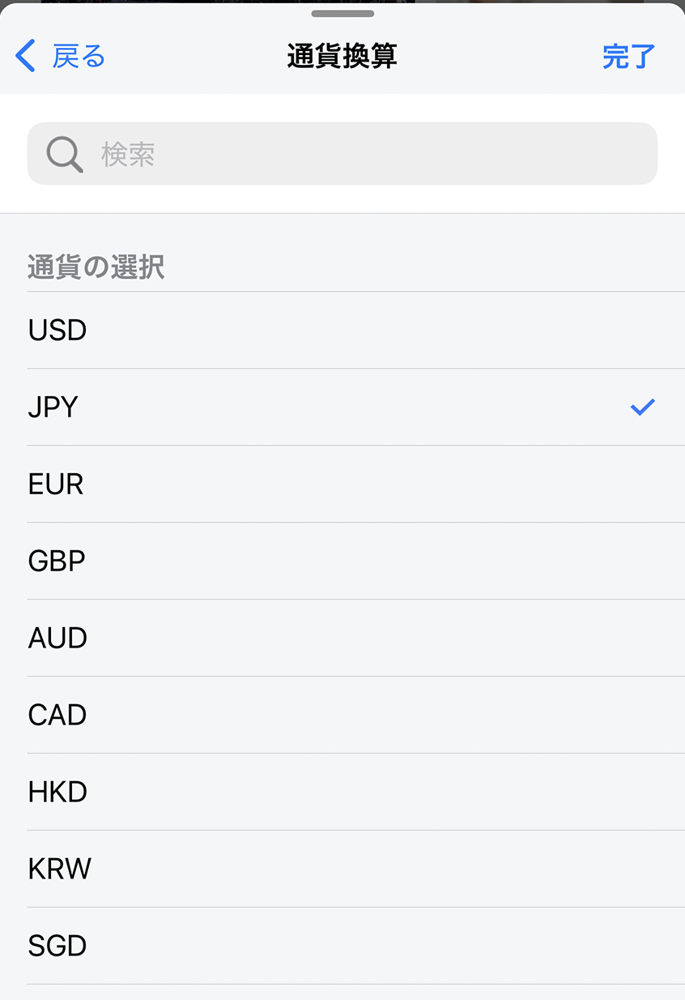
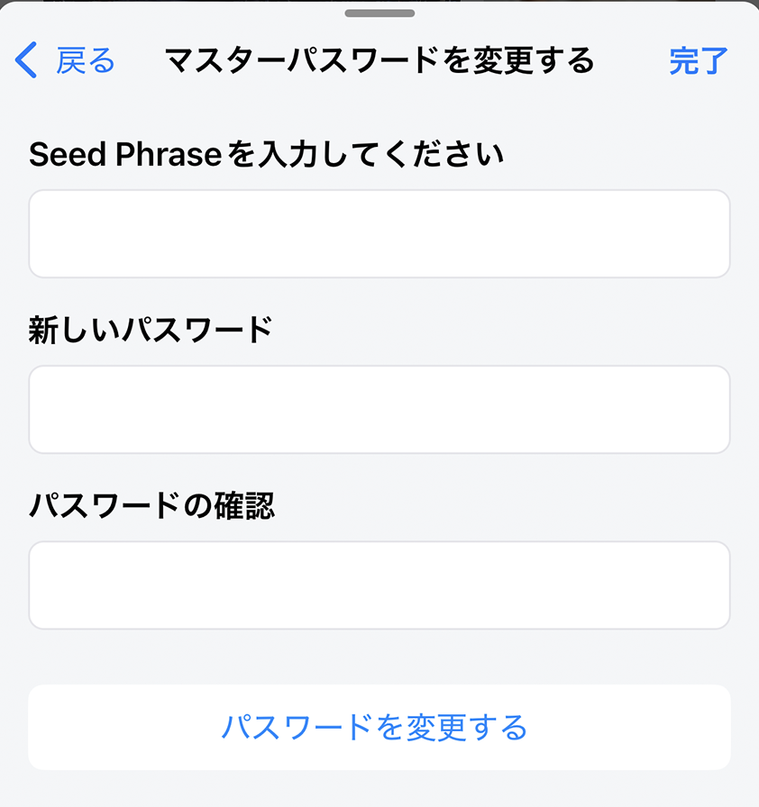
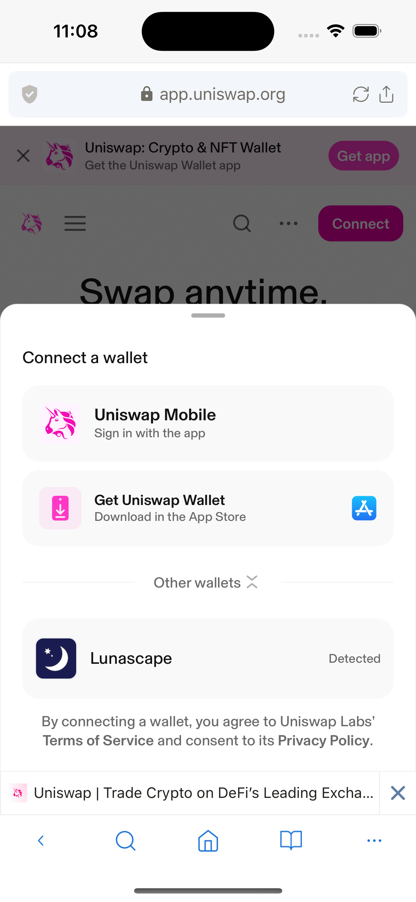
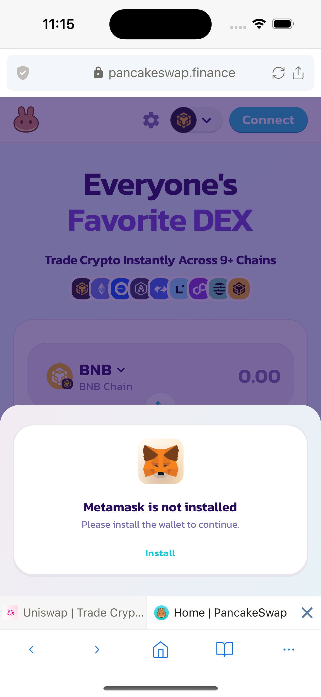

# ウォレット設定

## アカウント

既存のアカウントのリストと現在選択されているアカウントを表示します。

ユーザーはウォレットに1つまたは複数のアカウントを追加できます。
Lunascapeは新しいアカウントを追加する2つの形式をサポートしています：

- アカウント作成：使用中のシードフレーズから新しいアカウントを作成。
- 秘密鍵をインポート：秘密鍵から新しいアカウントを作成。

**アカウント詳細**

アカウント詳細画面に表示される情報：

- アカウント名
- アドレス
- 秘密鍵

ユーザーはアカウント名フィールドのみを編集できます。

アプリケーションは便利な使用のためにアドレスと秘密鍵フィールドのクリップボード機能をサポートしています。

ユーザーはここでアカウント削除操作も実行できます。

## アドレス帳

アドレス帳リストを表示します。

ユーザーは友人のアドレスや他のウォレットのアカウントアドレスなど、よく知っているアドレスを追加できます。
この機能により、ユーザーは混乱を心配することなく、トークンを便利に送信できます。

**連絡先を追加**

サポートされているフィールド：

- 名前：ニーモニック名
- アドレス
- 説明：連絡先の詳細な説明を追加

## ネットワーク

追加されたネットワークのリストと現在選択されているネットワークを表示します。

ユーザーはネットワークの選択/追加/編集操作を実行できます。

**ネットワークを追加**

ネットワークを追加するには、以下の情報が必要です：

- ネットワーク名（必須）：正しいネットワーク名または任意
- RPC URL（必須）
- チェーンID（必須）：正しいRPC URLを入力すると、チェーンIDが自動的に取得されます。手動で入力することもできます。
- シンボル（必須）：ネットワークのネイティブトークンの
- トークン名（必須）：ネットワークのネイティブトークンの
- ブロックエクスプローラーURL（任意）

既に追加されたネットワークについては、ユーザーはブロックエクスプローラーURLフィールドのみを編集できます。

## 通貨変換

サポートされている法定通貨のリストを表示します。
トークン残高の変換値は、選択された法定通貨で表示されます。

現在、Lunascapeは9つの法定通貨をサポートしています：

- USD
- JPY
- EUR
- GBP
- AUD
- CAD
- HKD
- KRW
- SGD

ユーザーはここで法定通貨の選択を変更できます。

## WalletConnect

WalletConnectセッションのリストを表示します。

ユーザーは新しい接続ボタンをクリックしてWalletConnect経由でDAppに接続できます。QRコードスキャン画面が表示されます。

さらに、ユーザーはホームアプリまたはウォレットダッシュボードのQRコードスキャンアイコン付きボタンをクリックしてWalletConnect経由でDAppに接続することもできます。

WalletConnect画面で、ユーザーは現在接続されているセッションを削除でき、これによりWalletConnect経由でのDAppへの接続もキャンセルされます。

## 許可されたWebサイト

ウォレットへの接続が許可されたWebサイトのリストを表示し、アカウント別にグループ化します。

ユーザーがWeb DAppでアクティブで、ウォレットアカウントに接続すると、接続確認ポップアップが表示され、ユーザーにWebサイトへの許可を付与するかどうかが尋ねられます。ユーザーが同意すると、そのDApp WebサイトのURLが自動的に許可されたWebサイトのリストに追加されます。

このリストに既にあるWebサイトについては、Web DAppへのその後の訪問で、ユーザーの確認なしに自動的にウォレットアカウントが接続されます。

したがって、ユーザーは接続したいDAppを慎重に確認する必要があります。不安全性を発見した場合は、そのWebサイトを許可されたWebサイトのリストから削除してください。

ユーザーはここでリストに追加機能を使用して手動で追加することもできます。

## シードフレーズをエクスポート

ウォレットのシードフレーズを表示します。この画面を開く際は非常に注意してください。

## マスターパスワードを変更

この機能を使用する方法は2つあります。

**方法1：ウォレットの現在のパスワードを忘れた場合にウォレットパスワードをリセットするために使用。**

LunascapeはFace ID/Touch IDログインをサポートしています。したがって、ユーザーはウォレットパスワードを忘れても、通常通りウォレットを使用できます。この場合、ユーザーはこの機能を使用してウォレットパスワードをリセットできます。現在のシードフレーズ（シードフレーズをエクスポートを参照）を取得し、シードフレーズを入力フィールドに記入して新しいパスワードを作成します。

ユーザーは以下に十分注意する必要があります：

- マスターパスワード変更機能は、入力されたシードフレーズに従ってウォレットを再作成します。したがって、現在のウォレットのすべてのデータが削除されます。ウォレットアカウントリスト、トークンリスト、ネットワークリスト、取引履歴が含まれます。この機能を使用する前に、必要なデータをバックアップしてください。
- ユーザーが現在のシードフレーズを使用してパスワードをリセットする場合。アカウント→アカウント作成方法で作成されたウォレットアカウントは、後で入力されたシードフレーズで再作成できます。
- アカウント→秘密鍵をインポート方法で作成されたウォレットアカウントは、シードフレーズから再作成できないため、これらのアカウントの秘密鍵を慎重にバックアップしてください。

**方法2：新しいシードフレーズで新しいウォレットを作成するために使用。**

ユーザーは新しいシードフレーズで新しいウォレットを作成し、ウォレットパスワードをリセットできます。ただし、シードフレーズ、秘密鍵などの現在のウォレットデータをバックアップすることを忘れないでください。

注意事項は上記の方法1で与えられた注意事項と同じです。

## Face ID / Touch IDでロック解除（iOSのみ）

LunascapeはFace ID / Touch IDを使用してウォレットを開くことをサポートしています。この機能はセキュリティを強化し、ユーザー体験を向上させます。

## Face ID / Touch IDで取引を送信（iOSのみ）

デフォルトでは、ユーザーが取引を行うたびに、ユーザーは取引を確認するためにウォレットパスワードを入力する必要があります。

Lunascapeはセキュリティを強化し、ユーザー体験を向上させるためにFace ID / Touch IDで取引を行う機能をサポートしています。

## ethereum.isMetaMaskを有効にする

*デフォルト：false*

Uniswapなどの一部のDAppでは、web3ウォレットが自動的に検出され、接続が許可されます。

このようなDAppでは、ユーザーはethereum.isMetaMaskを有効または無効にでき、DAppとウォレットの接続には影響しません。

ただし、Pancakeswapなどの一部のDAppでは、通常、よく知られた、検証されたウォレットのみの接続オプションが表示されます。Lunascapeウォレットの接続オプションが表示されない場合があり、ユーザーはDAppとウォレットを接続できません。

この場合、ユーザーはethereum.isMetaMaskを有効にする必要があります。
Lunascapeウォレットは、MetaMaskウォレットの名前でDAppによって検出されるようになります。DAppの上に表示されるMetaMaskオプション経由でDAppに接続できます。

*MetaMaskは人気の、検証された、非常に信頼できるweb3ウォレットで、ほとんどのDAppへの接続が許可されています。*
