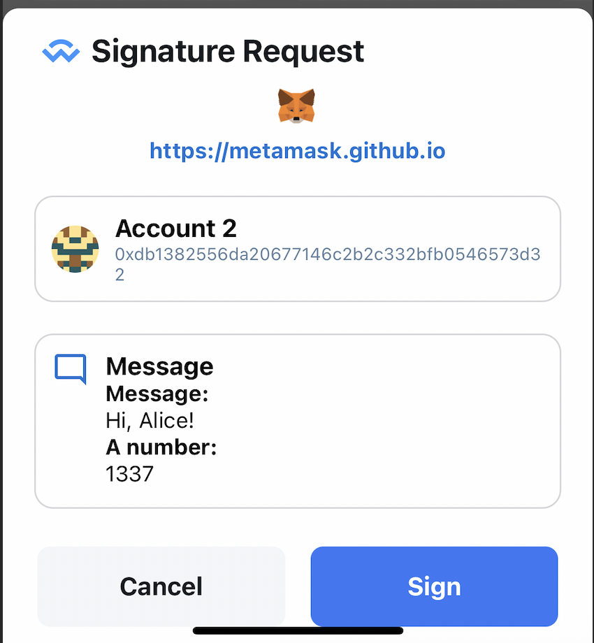

# WalletConnect

WalletConnectは、QRコードまたはディープリンクを介して暗号ウォレットと分散アプリケーション（dApps）間の安全な接続を可能にする**オープンソースプロトコル**です。ユーザーが秘密鍵をdAppと直接共有することなく、取引に署名し、認証することを可能にします。

詳細はこちら：[https://walletconnect.network/](https://walletconnect.network/)

LunascapeアプリはQRコードとディープリンクの両方でWalletConnectを完全にサポートしています

## QRコード経由でDAppに接続

DAppで、ユーザーはWalletConnect経由でウォレットに接続することを選択します。接続QRコードが生成され、表示されます。

Lunascapeアプリケーションで、ユーザーはQRコードスキャンアイコン付きのボタンをクリックします

ホーム画面

またはウォレット/ダッシュボード

その後、QRコードをスキャンして接続します。接続確認ポップアップが表示され、ユーザーが確認します。

## ディープリンク経由でDAppに接続

DAppで、Lunascapeウォレットに接続するために移動します。

Lunascapeウォレットをクリックすると、Lunascapeアプリを開くことを確認するポップアップが表示されます。ユーザーは開くをクリックしてLunascapeアプリを開き、接続を行います。

Lunascapeアプリが開かれると、DAppへの接続を確認するポップアップが表示されます。ユーザーが接続を確認します。

## WalletConnectセッション

WalletConnect経由でDAppに正常に接続すると、セッションが作成されます。
ユーザーはウォレット→設定→WalletConnectで接続されたセッションのリストを確認できます。

WalletConnect画面で、ユーザーは接続セッションを削除できます。ユーザーがセッションを削除すると、DAppは自動的にウォレットから切断されます。

逆に、DAppで、ユーザーがウォレットから切断すると、接続されたセッションもLunascapeアプリケーションのWalletConnect画面のリストから自動的に削除されます。

## 取引に署名

Lunascapeは以下の署名タイプをサポートしています：

- Personal Sign

- Sign Typed Data

- Sign Typed Data V3

- Sign Typed Data V4

## 取引を送信

ユーザーがDAppで取引を行うと、確認ポップアップがLunascapeアプリに表示されます。

現在LunascapeはLegacy Transactionのみをサポートしています。

EIP1559 Transactionは将来のバージョンでサポートされる予定です。

## ネットワークを切り替え

DAppがネットワークを変更すると、ネットワーク切り替え確認ポップアップが表示され、ユーザーが確認します。

